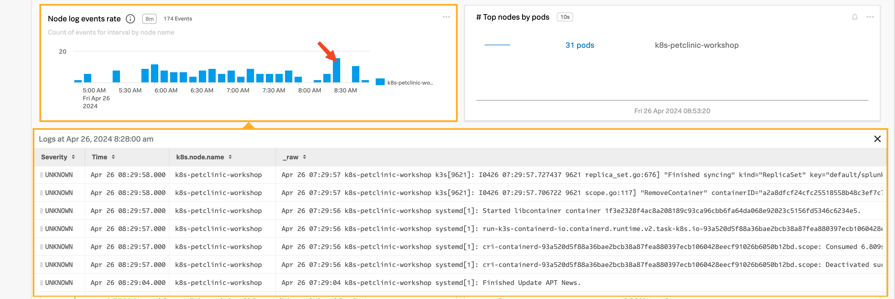

Once the installation has been completed, you can log in to **Splunk Observability Cloud** and verify that the metrics are flowing in from your Kubernetes cluster.

From the left-hand menu click on **Infrastructure**  and select **Kubernetes** and then select the **K8s nodes** pane. Once you are in the **K8s node** view, change the **Time** filter from **4h** to the **last 15 Minutes (-15m)** to focus on the latest data.

Next, click **Add filters** (next to the **Time filter**) and add the filter `k8s.cluster.name` **(1)**. Type or select the cluster name of your workshop instance (you can get the unique part from your cluster name by using the `INSTANCE` from the output from the shell script you ran earlier). (You can also select your cluster by clicking on its image in the cluster pane.)
You should now only have your cluster visible **(2)**.

You should see metrics **(3)** of your cluster and the log events **(4)** chart should start to be populated with log line events coming from your cluster. Click on one of the bars to peek at the log lines coming in from your cluster.

## USING OTEL RECEIVER THIS WILL NOT APPEAR

Also, a `Mysql` pane **(5)** should appear, when you click on that pane, you can see the MySQL-related metrics from your database.

Once you see data flowing in from your host (`metrics and logs`) and MySQL shows `metrics` as well we can move on to the actual PetClinic application.
