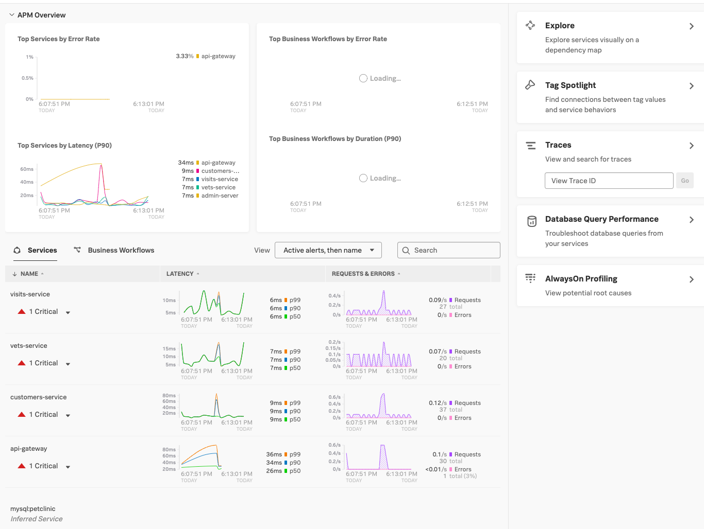
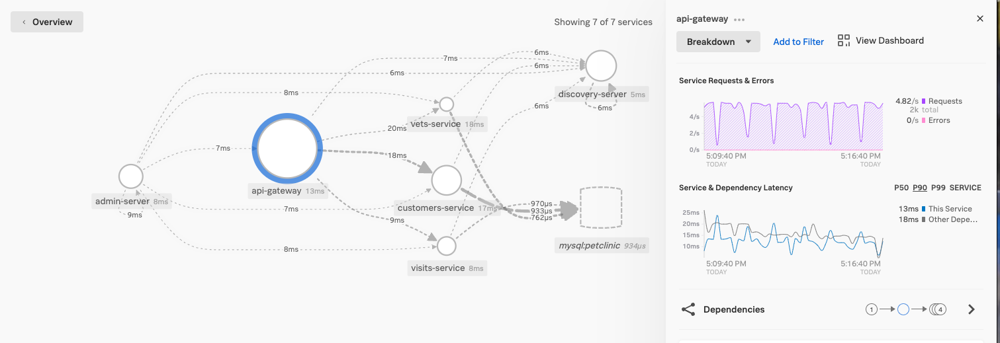

## NEED TO UPDATE TO USE SERVICE CENTRIC VIEW

 Splunk APM provides a set of built-in dashboards that present charts and visualized metrics to help you see problems occurring in real time and quickly determine whether the problem is associated with a service, a specific endpoint, or the underlying infrastructure.
 
 To look at this dashboard for the selected `api-gateway`, make sure you have the `api-gateway` service selected in the Dependency map as shown above, then click on the ***View Dashboard** Link **(1)**  at the top of the right-hand pane. This will bring you to the services dashboard:


This dashboard, which is available for each of your instrumented services, offers an overview of the key `request, error, and duration (RED)` metrics based on Monitoring MetricSets created from endpoint spans for your services, endpoints, and Business Workflows. They also present related host and Kubernetes metrics to help you determine whether problems are related to the underlying infrastructure, as in the above image.

As the dashboards allow you to go back in time with the *Time picker* window **(1)**, it's the perfect spot to identify the behavior you wish to be alerted on, and with a click on one of the bell icons **(2)** available in each chart, you can set up an alert to do just that.

If you scroll down the page, you get host and Kubernetes metrics related to your service as well.
Let's move on to look at some of the traces generated by the automatic discovery and configuration.
<!--

{}

``` bash
. ~/workshop/petclinic/scripts/tail_logs.sh
```

{}
{}

```text
{"severity":"error","msg": "Error: net::ERR_CONNECTION_REFUSED at http://10.13.2.123:81/#!/welcome"}
{"severity":"error","msg": "Error: net::ERR_CONNECTION_REFUSED at http://10.13.2.123:81/#!/welcome"}
{"severity":"info","msg":"Welcome Text = "Welcome to Petclinic"}
{"severity":"info","msg":"@ALL"}
{"severity":"info","msg":"@owner details page"}
{"severity":"info","msg":"@pet details page"}
{"severity":"info","msg":"@add pet page"}
{"severity":"info","msg":"@veterinarians page"}
{"severity":"info","msg":"cookies was"}
```

{}


Once the services are fully initialized, you now should see all the different services appear in Splunk APM:

Of course, we want to check the Dependency map by clicking Explore:

-->