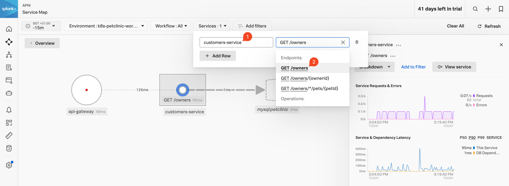
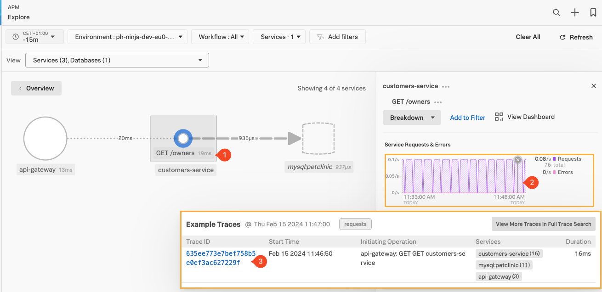
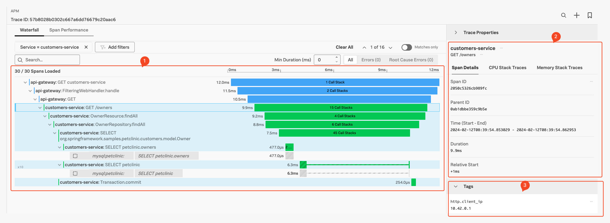

## 1. Introduction

As we have seen in the previous chapter, once you have enabled Zero Config Auto Instrumentation and started to run invocations through your application, traces will be sent to **Splunk** Observability Cloud Suite**
With these traces Splunk will automatically generate Dependency Maps and RED Metrics. In this next section, we are going to examine the traces themselves and what information they provide to help you understand the behavior of your services all without touching your code.

Make sure you are in the APM Explorer page either by going back in the browser or navigating to the **APM**  section in the Menu bar, then click on the **Explore** tile.

## 2. Examine a Trace from the APM Dependency map

For this exercise we are going to use a common scenario you would use if the service operation was showing high latency, or errors for example.

Select the **Customer Service** in the Dependency map **(1)**, then make sure the `customers-service` is selected in the **Services** dropdown box **(2)**. Next, select `GET /Owners` from the Operations dropdown **(3**)**.



This should give you the workflow with a filter on `GET /owners` **(1)** as shown below. To pick a trace, select a line in the `Service Requests & Errors` chart **(2)**, when the dot appears click to get a list of sample traces:



Once you have the list of sample traces, click on the blue **(3)** Trace ID Link. (Make sure it has the same three services mentioned in the Service Column.)

This brings us the the Trace selected in the Waterfall view:



Here we find several sections:  

* The actual Waterfall Pane **(1)**, where you see the trace and all the instrumented functions visible as spans, with their duration representation and order/relationship showing.
* The Trace Info Pane  **(2),  by default, shows the selected Span information. (Highlighted with a box around the Span in the Waterfall Pane.)
* The Span Pane **(3)**,   here you can find all the Tags that have been sent in the selected Span, You can scroll down to see all of them.
* The process Pane, with tags related to the process that created the Span (Scroll down to see as it is not in the screenshot.)
* The Trace Properties at the top of the right-hand pane by default is collapsed as shown.

First, let's examine a Span:

## 3. Spans and Zero Config Auto-Instrumentation features

While we examine our spans, let's look at several features that you get out of the box without code modifications when using Zero config Auto-Instrumentation on top of tracing:

Due to the fact there are several different routes
First, in the Waterfall Pane, make sure the `customers-service:SELECT petclinic.owners`  or similar span is selected as shown in the screenshot below:


* The basic latency information is shown as a bar for the instrumented function or call, in our example, it took 6.3 Milliseconds.
* Several similar Spans **(1)**, only visible if the span is repeated multiple times. In this case, there are 10 repeats in our example. (You can show/hide them all by clicking on the `10x` and all spans will show in order)
* Inferred Services, Calls done to external systems that are not instrumented, show up as a gray 'inferred' span. The Inferred Service or span in our case here is a call to the Mysql Database `mysql:petclinic SELECT petclinic` **(2)** as shown below our selected span.
* Span Tags in the Tag Pane, standard tags produced by the auto instrumentation agent. In this case, the span is calling a Database, so it includes the `db.statement` tag **(3)**. This tag will hold the DB query statement and is used by the Database call performed during this span. This will be used by the DB-Query Performance feature. We look at DB-Query Performance in the next section.
* Always-on Profiling, **IF** the system is configured to, and has captured Profiling data during a Spans life cycle, it will show the number of Call Stacks captured in the Spans timeline. (15 Call Stacks for the  `customers-service:SELECT petclinic.`owners` Span shown above). We will look at Profiling in the next section.

<!--
## 3. Review Profiling Data Collection

You can now visit the Splunk APM UI and examine the application components, traces, profiling, DB Query performance and metrics. From the left-hand menu **APM** → **Explore**, click the environment dropdown and select your environment e.g. `<INSTANCE>-petclinic` (where`<INSTANCE>` is replaced with the value you noted down earlier).


Once your validation is complete you can stop the application by pressing `Ctrl-c`.

## 4. Adding Resource Attributes to Spans

Resource attributes can be added to every reported span. For example `version=0.314`. A comma-separated list of resource attributes can also be defined e.g. `key1=val1,key2=val2`.

Let's launch the PetClinic again using new resource attributes. Note, that adding resource attributes to the run command will override what was defined when we installed the collector. Let's add two new resource attributes `deployment.environment=$INSTANCE-petclinic-env,version=0.314`:

```bash
java \
-Dserver.port=8083 \
-Dotel.service.name=$INSTANCE-petclinic-service \
-Dotel.resource.attributes=deployment.environment=$INSTANCE-petclinic-env,version=0.314 \
-jar target/spring-petclinic-*.jar --spring.profiles.active=mysql
```

Back in the Splunk APM UI we can drill down on a recent trace and see the new `version` attribute in a span.

-->