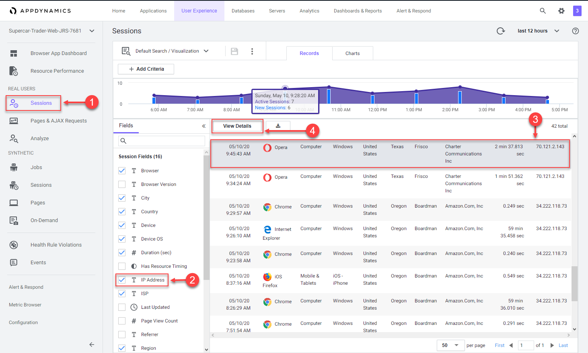
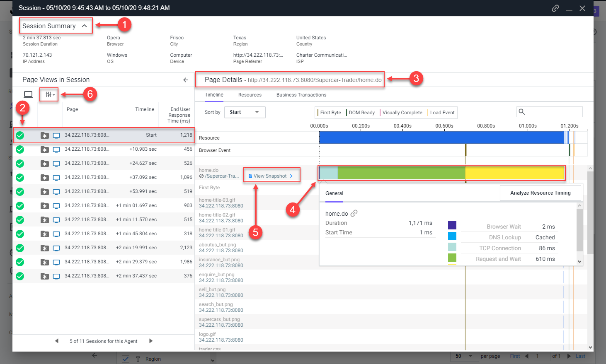
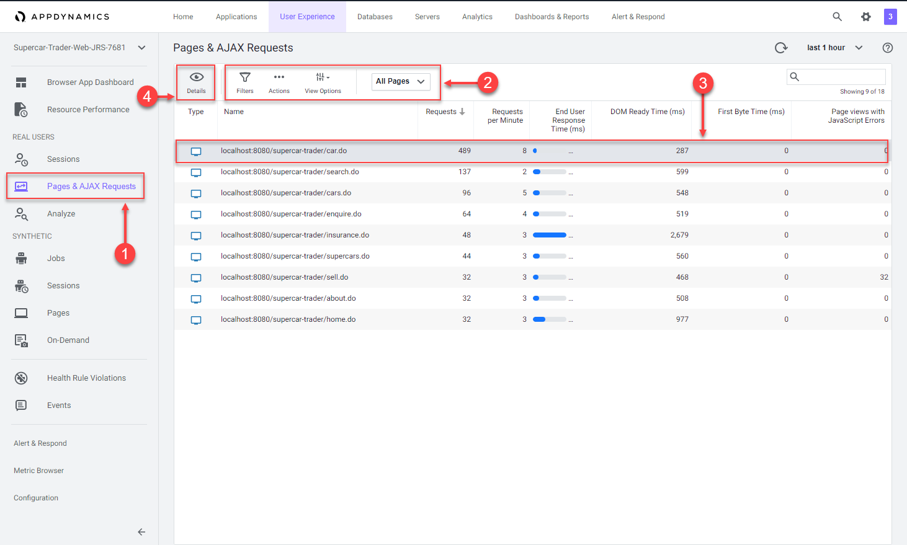
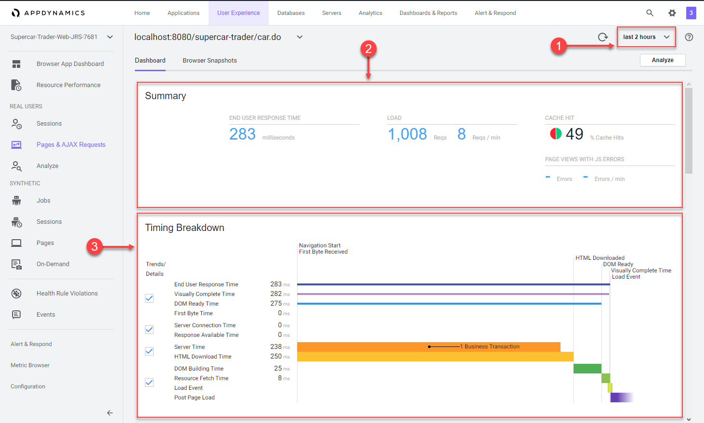
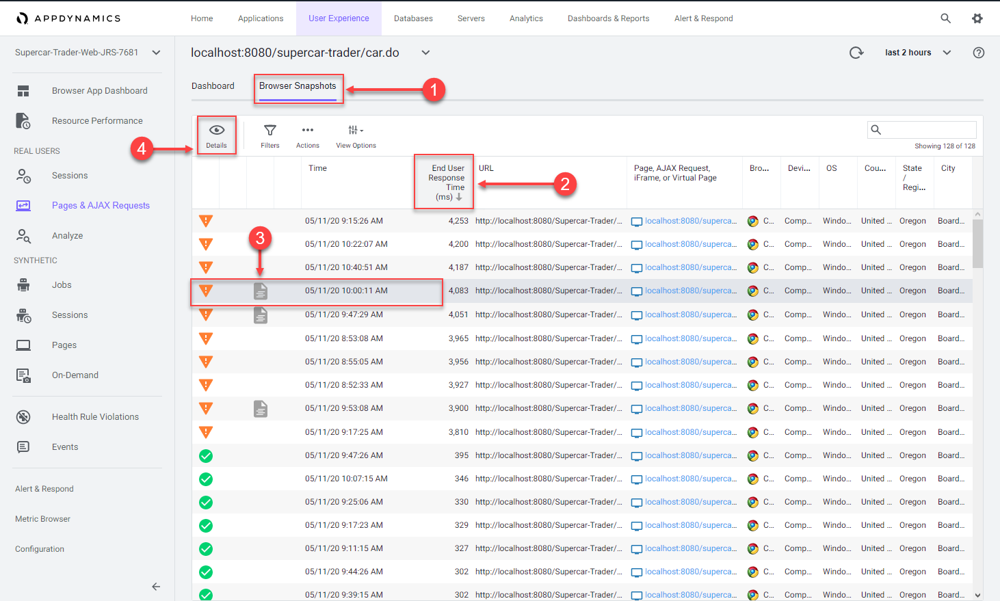
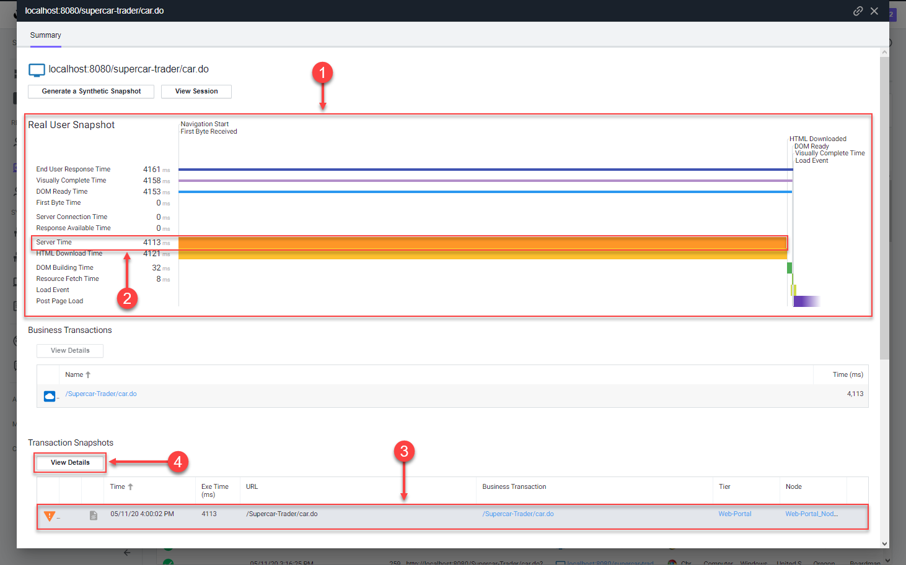
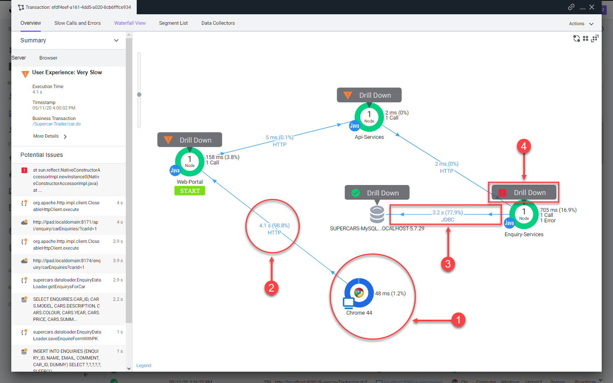

In this exercise you will complete the following tasks:

*   Review the Browser Session you created.
*   Review the Pages & AJAX Requests Dashboard.
*   Review the Dashboard for a specific Base Page.
*   Troubleshoot a Browser Snapshot.

## Review the Browser Session you created

You can think of sessions as a time-based context to analyze a user’s experience interacting with an application. By examining browser sessions, you can understand how your applications are performing and how users are interacting with them. This enables you to better manage and improve your application, whether that means modifying the UI or optimizing performance on the server side.

Navigate to the Sessions dashboard and find the browser session that you created in the last exercise from navigating the pages of the web application. Follow these steps.

> _Note:_ You may need to wait ten minutes after you hit the last page in the web application to see your browser session show up in the sessions list. If you don’t see your session after ten minutes, this could be due to a problem with the Java Agent version in use.
> 
> You can try using an earlier version of the Java agent which can be downloaded [**here**](https://accounts.appdynamics.com/downloads). Remember to make a backup copy of your existing **controller-info.xml** configuration file and use the settings in it when installing a different version of the Java agent. You can find more information about configuring the Java agent [**here**](https://help.splunk.com/en/appdynamics-saas/application-performance-monitoring/25.7.0/install-app-server-agents/java-agent/install-the-java-agent/configure-the-java-agent).

**1.** Click the **Sessions** tab on the left menu.

**2.** Check the **IP Address** in the Session Fields list.

**3.** Find the session you created by your IP Address.

**4.** Click on your session, then click **View Details**.

Once you find and open the session you created, follow these steps to explore the different features of the session view.

> _Note:_ Your session may not have a **View Snapshot** link in any of the pages (as seen in step five). You will find a session that has one to explore later in this exercise.

**1.** Click the **Session Summary** link to view the summary data.

**2.** When you click on a page listed on the left, you see the details of that page on the right.

**3.** You can always see the full name of the page you have selected in the left list.

**4.** Click on a horizontal blue bar in the waterfall view to show the details of that item.

**5.** Some pages may have a link to a correlated snapshot that was captured on the server side.

**6.** Click the configuration icon to change the columns shown in the pages list.

You can read more about the Browser RUM Sessions [**here**](https://help.splunk.com/en/appdynamics-saas/end-user-monitoring/25.7.0/end-user-monitoring/browser-monitoring/browser-real-user-monitoring/overview-of-the-controller-ui-for-browser-rum/browser-rum-sessions).

## Review the Pages & AJAX Requests Dashboard

Navigate to the Pages & AJAX Requests dashboard, review the options there, and open a specific Base Page dashboard by following these steps.

**1.** Click the **Pages & AJAX Requests** tab on the left menu.

**2.** Explore the options on the toolbar.

**3.** Click the **localhost:8080/supercar-trader/car.do** page.

**4.** Click **Details** to open the Base Page dashboard.

## Review the Dashboard for a specific Base Page

At the top of the Base Page dashboard you will see key performance indicators, End User Response Time, Load, Cache Hits, and Page Views with JS errors across the period selected in the timeframe dropdown from the upper-right side of the Controller UI. Cache Hits indicates a resource fetched from a cache, such as a CDN, rather than from the source.

In the Timing Breakdown section you will see a waterfall graph that displays the average times needed for each aspect of the page load process. For more information on what each of the metrics measures, hover over its name on the left. A popup appears with a definition. For more detailed information, see [**Browser RUM Metrics**](https://help.splunk.com/en/appdynamics-saas/end-user-monitoring/25.7.0/end-user-monitoring/browser-monitoring/browser-real-user-monitoring/browser-rum-metrics).

Review the details for the **localhost:8080/supercar-trader/car.do** Base Page by following these steps.

**1.** Change the timeframe dropdown to **last 2 hours**.

**2.** Explore the key performance indicators.

**3.** Explore the metrics on the waterfall view.

**4.** Use the vertical scroll bar to move down the page.

**5.** Explore the graphs for all of the KPI Trends.

You can read more about the Base Page dashboard [**here**](https://help.splunk.com/en/appdynamics-saas/end-user-monitoring/25.7.0/end-user-monitoring/browser-monitoring/browser-real-user-monitoring/overview-of-the-controller-ui-for-browser-rum/pages-and-ajax-requests/page-ajax-and-iframe-dashboards/page-and-iframe-dashboards).

## Troubleshoot a Browser Snapshot

Navigate to the Browser Snapshots list dashboard and open a specific Browser Snapshot by following these steps.

**1.** Click the **Browser Snapshots** option.

**2.** Click the **End User Response Time** column header twice to show the largest response times at the top.

**3.** Click on a browser snapshot that has a gray or blue icon in the third column from the left.

**4.** Click **Details** to open the browser snapshot.

Once you open the browser snapshot, review the details and find root cause for the large response time by following these steps.

**1.** Review the waterfall view to understand where the response time was impacted.

**2.** Notice the extended **Server Time** metric. Hover over the label for **Server Time** to understand its meaning.

**3.** Click the server side transaction that was automatically captured and correlated to the browser snapshot.

**4.** Click **View Details** to open the associated server side snapshot.

Once you open the correlated server side snapshot, use the steps below to pinpoint the root cause of the performance degredation.

**1.** You can see that the percentage of transaction time spent in the browser was minimal.

**2.** The timing between the browser and the Web-Portal Tier represents the initial connection from the browser until the full response was returned.

**3.** You will see that the JDBC call was taking the most time.

**4.** Click **Drill Down** to look at the code level view inside the Enquiry-Services Tier.

Once you open the snapshot segment for the Enquiry-Services Tier, you can see that there were JDBC calls to the database that caused issues with the transaction.

**1.** Click the **JDBC** link with the largest time to open the detail panel for the JDBC calls.

**2.** The detail panel for the JDBC exit calls shows the specific query that took most of the time.

**3.** You can see the full SQL statement along with the SQL parameter values

You can read more about the Browser Snapshots [**here**](https://help.splunk.com/en/appdynamics-saas/end-user-monitoring/25.7.0/end-user-monitoring/browser-monitoring/browser-app-dashboard/browser-snapshots_1) and [**here**](https://help.splunk.com/en/appdynamics-saas/end-user-monitoring/25.7.0/end-user-monitoring/browser-monitoring/browser-app-dashboard/browser-snapshots_1/page-snapshots).

**You have now completed this lab!**
