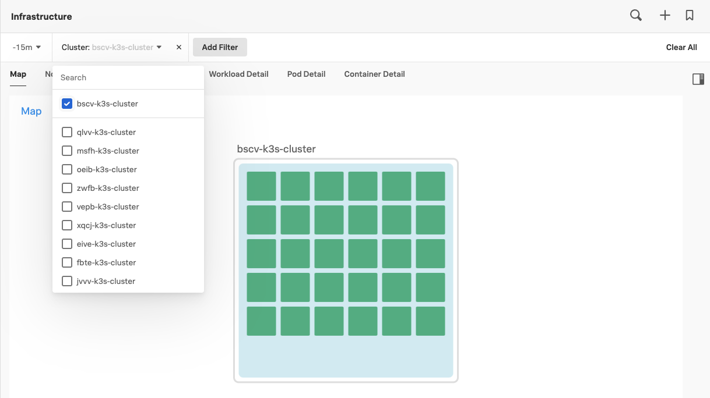
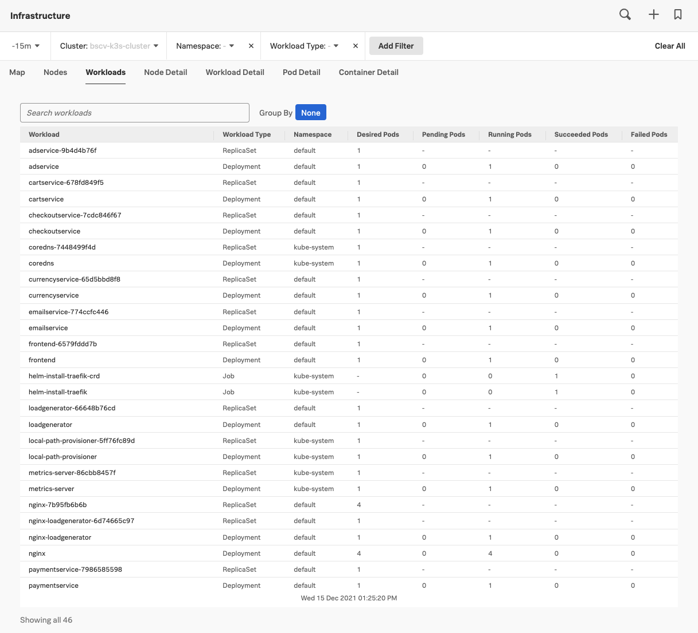
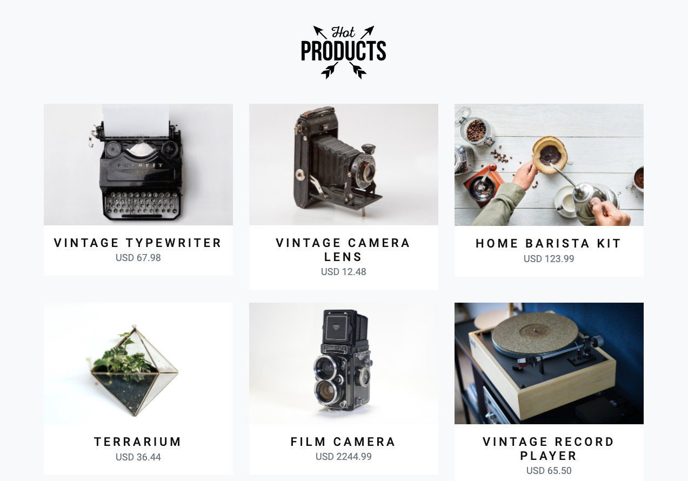

{}15 minutes{}

* {}**Ninja**{} Deploy the Online Boutique application in Kubernetes
* Verify the application is running
* Generate some artificial traffic using Locust
* See APM metrics in the UI

---

{{% expand title="{}**Ninja** - Deploy the Online Boutique{}" %}}

## 1. Check your EC2 server

This workshop module assumes you are completing this after you have run the IM workshop, and still have access to your EC2 instance.

If this is the case, continue with [**Deploy Online Boutique**](#2-deploy-online-boutique), otherwise, if you have received a fresh instance, please run the first two (2) sections of [**Deploy the OTel Collector**](../../imt/gdi/) to get the system ready for the APM workshop, then continue with the next section.

## 2. Deploy Online Boutique

To deploy the Online Boutique application into K3s apply the deployment:


{}

``` bash
cd ~/workshop/apm
kubectl apply -f deployment.yaml
```

{}
{}

``` text
APM Only Deployment
deployment.apps/recommendationservice created
service/recommendationservice created
deployment.apps/productcatalogservice created
service/productcatalogservice created
deployment.apps/cartservice created
service/cartservice created
deployment.apps/adservice created
service/adservice created
deployment.apps/paymentservice created
service/paymentservice created
deployment.apps/loadgenerator created
service/loadgenerator created
deployment.apps/shippingservice created
service/shippingservice created
deployment.apps/currencyservice created
service/currencyservice created
deployment.apps/redis-cart created
service/redis-cart created
deployment.apps/checkoutservice created
service/checkoutservice created
deployment.apps/frontend created
service/frontend created
service/frontend-external created
deployment.apps/emailservice created
service/emailservice created
deployment.apps/rum-loadgen-deployment created
```

{}


{}
Delete the deployment running `kubectl delete -f deployment.yaml`.

Then, export the variable as described in the guide/message, followed by re-running the deployment script above.
{}

To ensure the Online Boutique application is running:


{}

``` bash
kubectl get pods
```

{}
{}

``` text
NAME                                                       READY  STATUS  RESTARTS      AGE
splunk-otel-collector-k8s-cluster-receiver-849cf595bf-l7mnq 1/1   Running   0           31m
splunk-otel-collector-agent-pxrgp                           2/2   Running   0           31m
productcatalogservice-8464cd56d-n8f89                       1/1   Running   0            1m
redis-cart-bcf44df97-djv6z                                  1/1   Running   0            1m
checkoutservice-8558fd7b95-b9pn8                            1/1   Running   0            1m
shippingservice-7cc4bdd6f4-xsvnx                            1/1   Running   0            1m
recommendationservice-647d57fd44-l7tkq                      1/1   Running   0            1m
frontend-66c5d589d-55vzb                                    1/1   Running   0            1m
emailservice-6ff5bbd67d-pdcm2                               1/1   Running   0            1m
paymentservice-6866558995-8xmf2                             1/1   Running   0            1m
currencyservice-8668d75d6f-mr68h                            1/1   Running   0            1m
rum-loadgen-deployment-58ccf7bd8f-cr4pr                     1/1   Running   0            1m
rum-loadgen-deployment-58ccf7bd8f-qjr4b                     1/1   Running   0            1m
rum-loadgen-deployment-58ccf7bd8f-fvb4x                     1/1   Running   0            1m
cartservice-7b58c88c45-xvxhq                                1/1   Running   0            1m
loadgenerator-6bdc7b4857-9kxjd                              1/1   Running   2 (49s ago)  1m
adservice-7b68d5b969-89ft2                                  1/1   Running   0            1m
```

{}


{}
Usually it should only take around 1min 30secs for the pods to transition into a Running state.
{}

{}

## Validate Online Boutique is deployed

In the Splunk UI click on **Infrastructure** this will bring you to the Infrastructure Overview dashboard, then click on **Kubernetes**.

Use the **Cluster** dropdown to select the cluster name, you will see the new pods started and containers deployed. When you click on your Cluster in the Splunk UI you should have a view that looks like below:



If you select the **WORKLOADS** tab again you should now see that there are some Deployments and ReplicaSets:



## Visit the Online Boutique

{{% expand title="{}**Ninja** - Visit the Online Boutique you just deployed{}" %}}
{}

The Online Boutique is viewable on port 81 of the EC2 instance's IP address. The IP address is the one you used to SSH into the instance at the beginning of the workshop.

Open your web browser and go to `http://<ec2-ip-address>:81/` where you will then be able to see the Online Boutique running.
{}
{}

Your Workshop instructor will provide you with a URL to access the Online Boutique. Enter this URL into your browser and you will see the Online Boutique homepage.


