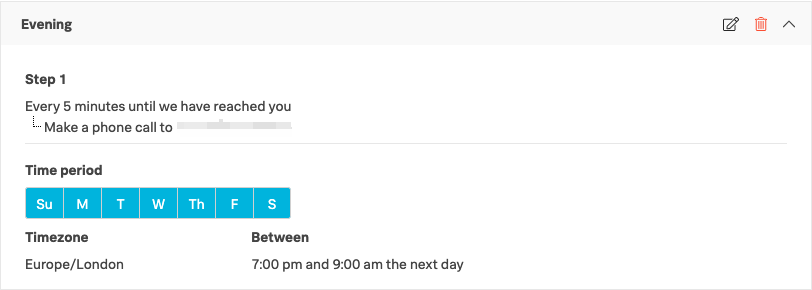

## Aim

The aim of this module is for you to configure your personal profile which controls how you will be notified by Splunk On-Call whenever you get paged.

## 1. Contact Methods

Switch to the Splunk On-Call UI and click on your login name in the top right hand corner and chose **Profile** from the drop down. Confirm your contact methods are listed correctly and add any additional phone numbers and e-mail address you wish to use.

## 2. Mobile Devices

To install the Splunk On-Call app for your smartphone search your phones App Store for Splunk On-Call to find the appropriate version of the app. The publisher should be listed as VictorOps Inc.

[Apple Store](https://apps.apple.com/us/app/victorops/id696974262)

[Google Play](https://play.google.com/store/apps/details?id=com.victorops.androidclient&hl=en)

Configuration help guides are available:

* [Apple](https://help.victorops.com/knowledge-base/ios-application/)
* [Android](https://help.victorops.com/knowledge-base/android-devices-victorops/)

Install the App and login, then refresh the Profile page and your device should now be listed under the devices section. Click the **Test push notification** button and confirm you receive the test message.

## 3. Personal Calendar

This link will enable you to sync your on-call schedule with your calendar, however as you do not have any allocated shifts yet this will currently be empty. You can add it to your calendar by copying the link into your preferred application and setting it up as a new subscription.

## 4. Paging Policies

Paging Polices specify how you will be contacted when on-call. The Primary Paging Policy will have defaulted to sending you an SMS assuming you added your phone number when activating your account. We will now configure this policy into a three tier multi-stage policy similar to the image below.

### 4.1 Send a push notification

Click the edit policy button in the top right corner for the Primary Paging Policy.

* Send a push notification to all my devices
* Execute the next step if I have not responded within 5 minutes

Click **Add a Step**

### 4.2 Send an e-mail

* Send an e-mail to [your email address]
* Execute the next step if I have not responded within 5 minutes

Click **Add a Step**

### 4.3 Call your number

* Every 5 minutes until we have reached you
* Make a phone call to [your phone number]

Click {}Save{} to save the policy.

When you are on-call or in the escalation path of an incident, you will receive notifications in this order following these time delays.

To cease the paging you must acknowledge the incident. Acknowledgements can occur in one of the following ways:

* Expanding the Push Notification on your device and selecting Acknowledge
* Responding to the SMS with the 5 digit code included
* Pressing 4 during the Phone Call
* Slack Button

For more information on Notification Types, see [here](https://help.victorops.com/knowledge-base/notification-types/).

## 5. Custom Paging Policies

Custom paging polices enable you to override the primary policy based on the time and day of the week. A good example would be to get the system to immediately phone you whenever you get a page during the evening or weekends as this is more likely to get your attention than a push notification.

Create a new Custom Policy by clicking **Add a Policy** and configure with the following settings:

### 5.1 Custom evening policy

Policy Name: Evening

* Every 5 minutes until we have reached you
  * Make a phone call to [your phone number]
  * Time Period: All 7 Days
  * Time zone
    * Between 7pm and 9am

Click {}Save{} to save the policy then add one more.

### 5.2 Custom weekend policy

Policy Name: Weekend

* Every 5 minutes until we have reached you
  * Make a phone call to [your phone number]
  * Time Period: Sat & Sun
  * Time zone
    * Between 9am and 7pm

Click {}Save{} to save the policy.

These custom paging policies will be used during the specified times in place of the Primary Policy. However, admins do have the ability to ignore these custom policies, and we will highlight how this is achieved in a later module.

The final option here is the setting for Recovery Notifications. These are typically low priority, will default to Push, but can also be email, sms or phone call. Your profile is now fully configured using these example configurations.

Organizations will have different views on how profiles should be configured and will typically issue guidelines for paging policies and times between escalations etc.

Please wait for the instructor before proceeding to the Teams module.
