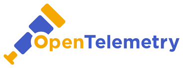

{}5 minutes{}

### OpenTelemetry explained

OpenTelemetry, an open-source project created by the Cloud Native Computing Foundation (CNCF), is a set of tools and libraries that help software developers gather information about how their applications are performing and behaving. It's like a set of instruments that allows you to monitor and measure what's happening inside your software, so you can understand its behaviour, identify issues, and optimize its performance, not unlike your local car mechanic.

OpenTelemetry can collect data about things like how long it takes for different parts of your software to execute, how many times certain functions are called, and other relevant information. This data is valuable for diagnosing problems, optimizing performance, and improving the overall quality of your applications.

Observability is built on this data, or Signals as they are also called, that are sent from your applications and infrastructure.

In essence, OpenTelemetry, with these Signals, provides a way to gather insights into your software's inner workings, making it easier to maintain, troubleshoot, and improve your applications.

### Splunk Observability Cloud and OpenTelemetry

There are a lot of variables to consider when getting started with Observability, including the all-important question: "How do I get my data into an Observability tool?" The industry-wide adoption of OpenTelemetry makes this question easier to answer than ever.

Why Should You Care?  
In the past, monitoring and Observability tools relied heavily on proprietary agents meaning that the effort required to change or set up additional tooling required a large amount of changes across systems, from the infrastructure level to the application level. Since OpenTelemetry is vendor-neutral and supported by many industry leaders in the Observability space, adopters can switch between supported Observability tools at any time with minor changes to their instrumentation.  Splunk Observability Cloud is designed around and fully supports the OpenTelemetry standard and signals.

