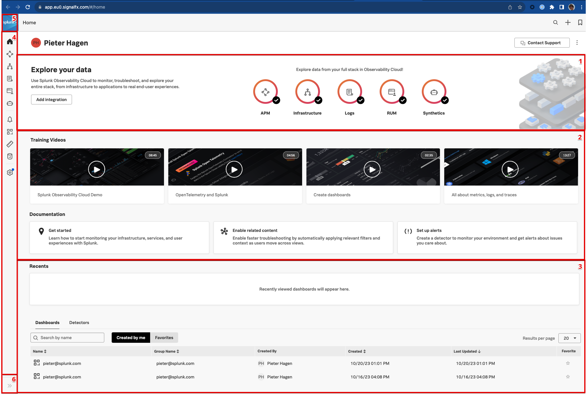

{}3 minutes{}

After you have registered and logged into the Splunk Observability Cloud UI you will be taken to the home page. Here, you will find a number of useful features to help you get started.

1. **Explore Data Pane:** Displays which integrations are enabled and you can add additional integrations.
2. **Onboarding Pane:** Training videos and links to documentation to get you started with Splunk Observability Cloud.
3. **Recent Pane:** Recently created/visited dashboards and/or detectors for quick access.
4. **Main Menu Pane:** Navigate the components of Splunk Observability Cloud.
5. **Org Switcher Pane:** Easily switch between Organizations, if you are a member of more than one Organization.
6. **Expand Menu Pane:** Expand/Collapse the main menu.

{}

* Click on **Settings** in the main menu.
* Click **Onboarding Guidance**, here you can toggle the visibility of the onboarding panes.
* Hide the Home page content.
* At the bottom of the menu, select your preferred appearance: **Light**, **Dark** or **Auto** mode.
* Did you also notice this is where the **Sign out** option is?
* Click **<** to get back to the main menu.

{}

Next, let's check out Application Performance Monitoring (APM).
