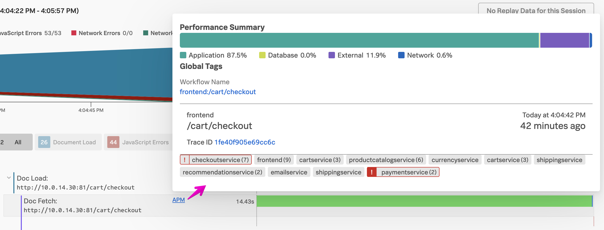
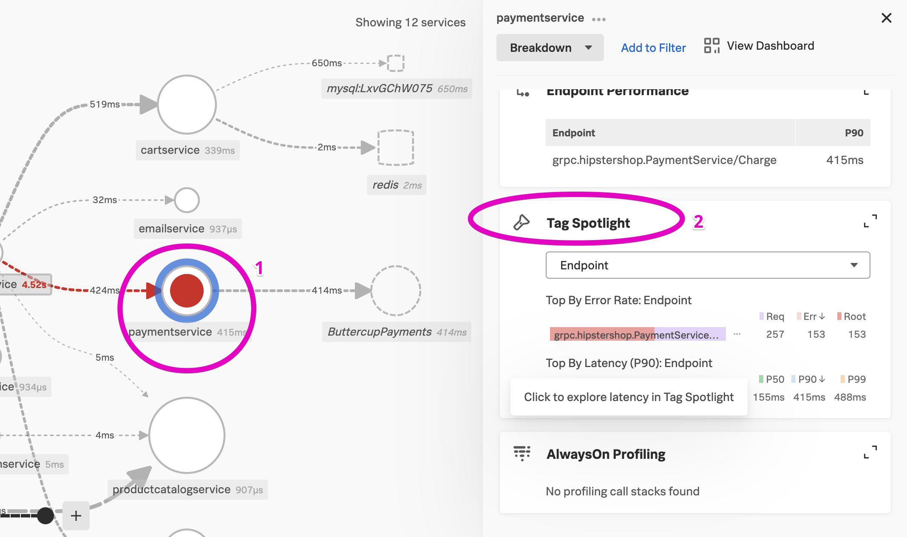
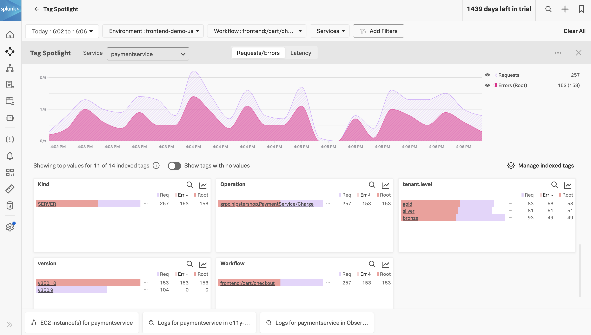
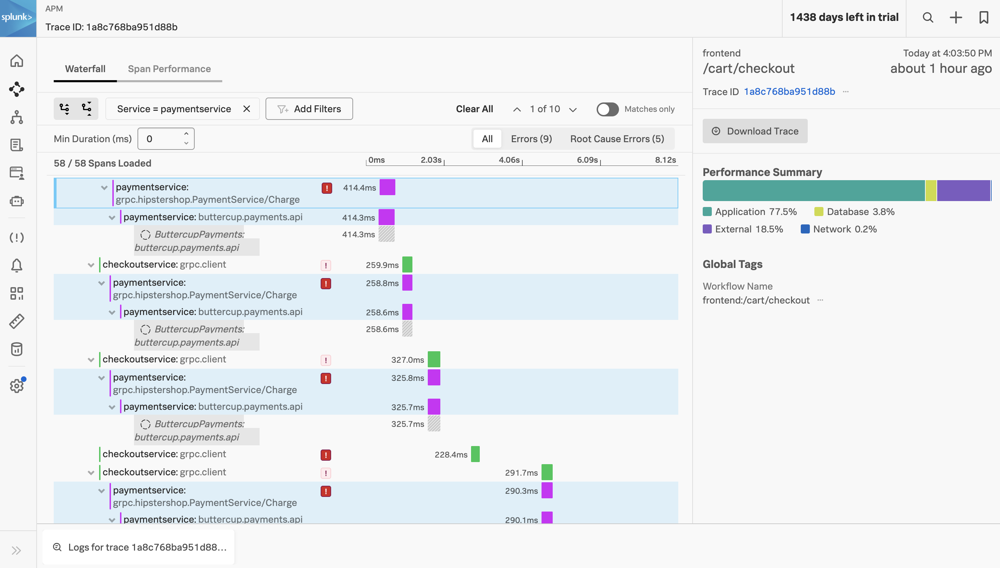

1. Arrived in APM from a RUM trace
2. Validate workflow is **frontend:/cart/checkout**. Talk to the service map and how it is auto-generated
3. Click on Overview
4. Validate environment is the correct workshop one
5. Ensure APM Overview is visible
6. What can you conclude from the top services by error rate chart?
7. Explain inferred services
8. Click Explore, explain that compared to earlier you now see all services (including inferred)
9. Click on the paymentservice, what can you conclude from the error rate chart?
10. Is there a pattern to this error rate? We have a handy tool for that, tag spotlight.
11. Click on tag spotlight
12. Ensure **Show tags with no values** is off.
13. What can you conclude from the data you are seeing? Which chart helped you come to this conclusion? (Answer is version).
14. Click on v350.10 add to filter
15. Return to explorer, click tag spotlight and clear all
16. Click on the payment service and then from breakdown select **version**
17. You can see all errors are due to v350.10
18. Click on traces and sort the traces by duration descending by longest duration
19. Select the 1st trace ensuring it has a long duration
20. What can you conclude is going on from the waterfall? (Answer multiple attempts)
21. Verify version is **v350.10** by looking at the metadata under tags.
22. Conclusion ... we have an problem.
23. Draw attention to related content ... TBC
24. Click on Logs for trace XXXXXXX

A trace is a collection of spans that share the same trace ID, representing a unique transaction handled by your application and its constituent services.

Each span has a name, representing the operation captured by this span, and a service name, representing within which service the operation took place.

Additionally, spans may reference another span as their parent, defining the relationships between the operations captured in the trace that were performed to process that transaction.

Each span contains a lot of information about the method, operation, or block of code that it captures, including:

* The operation name.
* The start time of the operation with microsecond precision.
* How long the operation took to execute, also with microsecond precision.
* The logical name of the service on which the operation took place.
* The IP address of the service instance on which the operation took place.

Hover over the APM link

This is where the end to end value of the Splunk Observability Cloud starts to show. We can hover over this APM link to reveal some quick, at a glance, info about what’s happening on the backend.

This performance summary is clearly showing two actionable things:

1. Time is being spent in the app (not db, network, or external); and
1. There are errors occurring in these back-end services, and I can see precisely which service is producing the “root cause” for this particular trace (in this case the payment service in dark red).

To dig further, I can explore two different paths, depending on the questions I want to ask.

Let’s explore both to understand why I might want to do one or the other.

Click on the Workflow Name “frontend:/cart/checkout” or open both links in new tabs

Viewing the service map

The service map confirms what we saw earlier, that the issues at this particular time are coming from the paymentservice. We can also see that it is relying on a external service.

We can use a capability called “Tag Spotlight” to understand if there is anything notable about these erroneous transactions.

Click on the paymentservice circle, and then click on “Tag Spotlight” on the right

Tag Spotlight is a powerful capability in Splunk Observability Cloud that helps us make sense of the unique transactions flowing through our application.

Tags can be indexed, both on the service where they originate, as well as globally (covering the entire transaction), to help developers understand more about a subset of the transactions that are occurring.

Point out the tenant level and version

At a glance we can see that the different kinds of customers (gold, bronze, and silver) are all similarly impacted, but the new version of our code (v350.10) has 100% of the errors.

In many investigations we might filter on some of these tags to narrow our view, but we have a pretty good picture already of what’s going on.

Click on one of the higher peaks, on the errors line, to get exemplars with errors

Now I can look at some of the specific traces that have errors, to understand precisely what happened.

Click on a trace that has root (solid red) errors on the paymentservice

Now I’m starting to get a good picture of what’s going on. This checkout process is making an API call to an external service over and over again and failing.

I’d like to look at the logs to see precisely what the error is.
