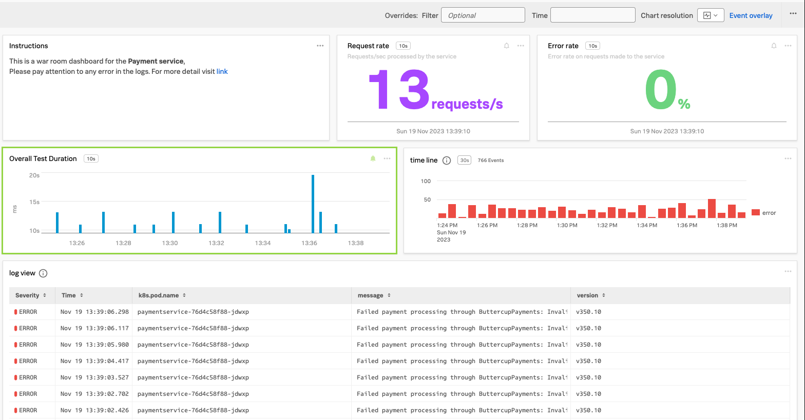

### WIP WIP WIP WIP WIP

Flow:

1. Go back to your war room dashboard with the two log charts
2. It can use a bit more information, so let's add request rate charts and Error rate charts.
3. Revisit APM, Select explore, and select the payment service.
4. Select the Dashboard option on the top right of the screen.
5. You should now be on the APM services map with the workshop and payment service selected.
6. Click on the three dots **...** and select *Copy*
7. Note that you now have a **1**  before the **+**  at the top right of the page, indicating you have a copied chart in your clipboard available.
8. Find your War room dashboard again.
9. Select the  **1+** at the top of the page and select Past Chart. this will create the chart in your dashboard.
10. Let's add some more, go back to the APM services dashboard either via the APM  or selecting the *APM services* dashboard group followed by the *service* dashboard from **Dashboards**
11. This time select Error rate, click on the **...**  and select copy, do the same for the error rate chart, but this time choose Add to dashboard. This will allow you to select and add multiple charts in one go. Note That the **+** now shows the number of charts copied into the clipboard.
12. Return to your war room dashboard and select past charts from the **+* menu.
13. At this point these charts are not filtered, so let's add the correct filter
14. Add `sf_environment=[WORKSHOPNAME]` and `sf_service=payment_service` to the override filter box.
15. Now with the info for our service let's rearrange the chart so that they are useful
16. Drag the Request rate to the top left, resize its width 50 percent by dragging the left edge, and add the Error rate chart next to it.
17. Drag the error rate chart next to the two the chart and resize it so it fills the page
18. click on **new text note* and replace the text below with the text in the note  then click save  name the chart instructions
{}

```text

This is a  war room dashboard for the **Payment service**,  
Please pay attention  to any error in the logs.
For more detail visit [link](https://https://www.splunk.com/en_us/products/observability.html)

```

{}
19. Place the instruction below the request rate chart, add the timeline log chart next to it and size it to fit the page.
20. Make sure the Log view chart is the bottom chart, is full size and extended to the bottom of your page.

The result should be like this:

