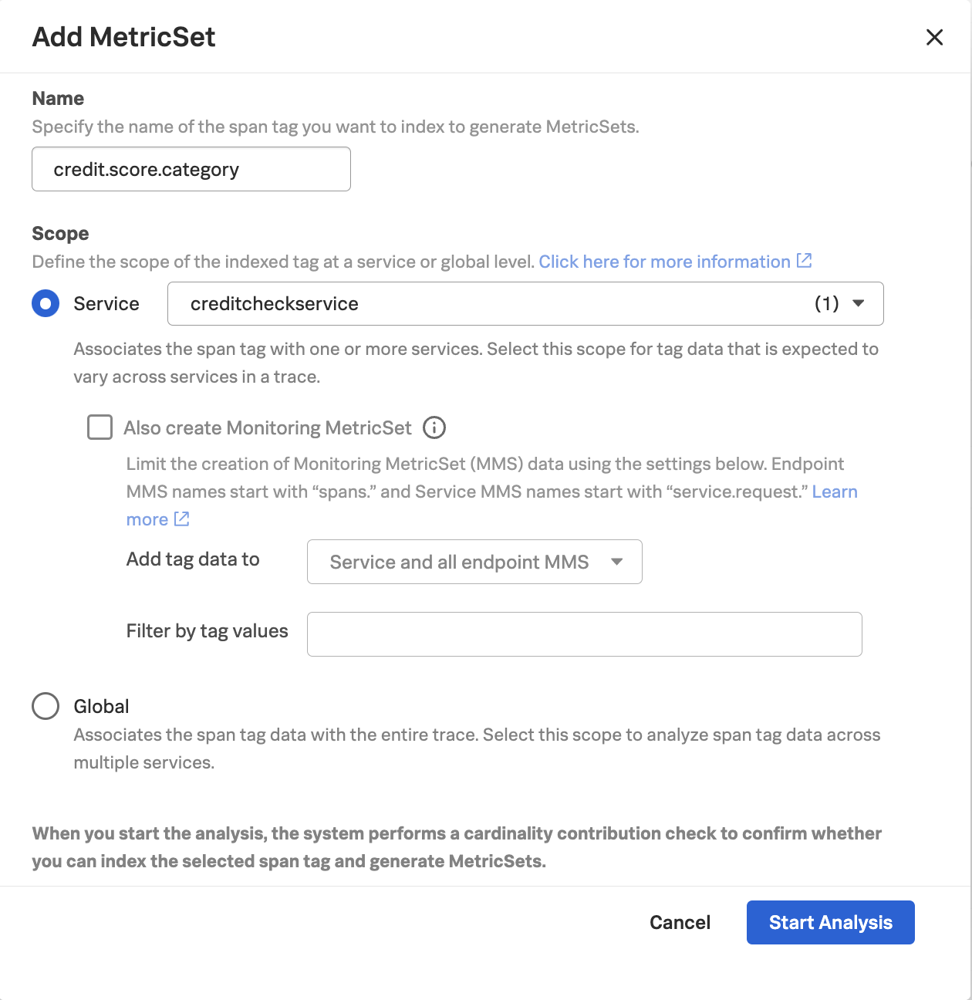

## Index Tags
To use advanced features in **Splunk Observability Cloud** such as **Tag Spotlight**, we'll need to first index one or more tags. 

To do this, navigate to **Settings** -> **APM MetricSets**.  Then click the **+ New MetricSet** button.  

Let's index the **credit.score.category** tag to start with, by filling in the following details: 

Click **Start Analysis** to proceed. 

The tag will appear in the list of **Pending MetricSets** while analysis is performed.  

Once analysis is complete, click on the checkbox in the **Actions** column.

## How to choose tags for indexing

Why did we choose to index the **credit.score.category** tag and not the others? 

To understand this, it’s helpful to understand the primary use cases for attributes:

* Filtering
* Grouping

With the filtering use case, we can use the Trace Analyzer capability of Splunk Observability Cloud to filter on traces that match a particular attribute value.  We saw an example of this earlier, when we filtered on traces where the credit score started with "7". Or if a customer called in to complain about slow service, we could use Trace Analyzer to locate all traces with their particular cusotmer number. 

To use Trace Analyzer, it's not necessary to index tags. 

On the other hand, with the grouping use case, we can surface trends for attributes that we collect using the powerful Tag Spotlight feature in Splunk Observability Cloud, which we'll see in action shortly.  

Applying grouping to our trace data allows us to rapidly surface trends and identify patterns.  

Attributes used for grouping should be low to medium-cardinality, with hundreds of unique values. For custom attributes to be used with Tag Spotlight, they first need to be indexed.

So we decided to index the **credit.score.category** tag because it has a few distinct values that would be useful for grouping. In contract, the customer number and credit score tags can have hundreds or thousands of values, and are more valuable for filtering rather than grouping. 

## Troubleshooting vs. Monitoring Metric Sets 

You may have noticed that, to index this tag, we created something called a **Troubleshooting Metric Set**. It's named this was because a Troubleshooting Metric Set, or TMS, allows us to troubleshoot features with this tag using features such as Tag Spotlight, which we'll explore next. 

You may have also noticed that there's another option, which we didn't choose, which is called a **Monitoring Metric Set**.  Monitoring Metric Sets go beyond troubleshooting and allow us to use tags for alerts, dashboards, and more.  We'll explore this later in the workshop. 

