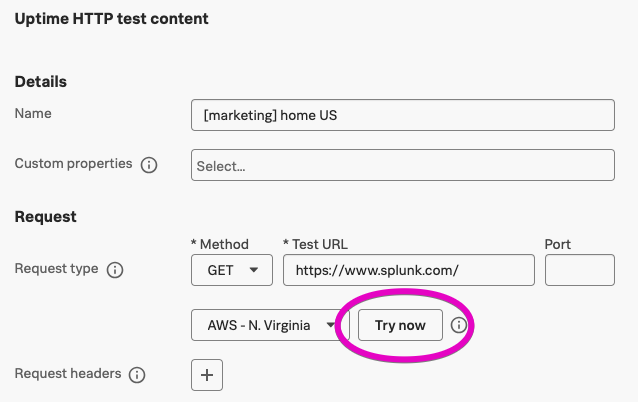

We have started testing our endpoints, now let's test the front end browser experience.

Starting with a single page [browser test](https://docs.splunk.com/observability/en/synthetics/browser-test/browser-test.html) will let us capture how first- and third-party resources impact how our end users experience our browser-based site. It also allows us to start to understand our user experience metrics before introducing the complexity of multiple steps in one test.

A page where your users commonly "land" is a good choice to start with a single page test. This could be your site homepage, a section main page, or any other high-traffic URL that is important to you and your end users. 

1. Click {}Add new test{} and select Browser test

2. Include your **team name** and **initials** in the test name. Add to the Name and Custom properties to describe the scope of the test (like Desktop for device type). Then click + Edit steps

3. Change the transaction label (top left) and step name (on the right) to something readable that describes the step. Add the URL you'd like to test. Your workshop instructor can provide you with a URL as well. In the below example, the transaction is "Home" and the step name is "Go to homepage".

4. To validate the test, change the location as needed and click Try now. See the docs for more information on the [try now feature](https://docs.splunk.com/observability/en/synthetics/test-config/try-now.html).

5. Wait for the test validation to complete. If the test validation failed, double check your URL and test location and try again. With Try now you can see what the result of the test will be if it were saved and run as-is.

6. Click {}< Return to test{} to continue the configuration.

7. Edit the locations you want to use, keeping in mind any regional rules you have for your site.

8. You can edit the Device and Frequency or leave them at their default values for now. Click {}Submit{} to save the test and start running it.

{}
Have a few spare seconds? Copy this test and change just the title and device type, and save. Now you have visibility into the end user experience on another device and connection speed!
{}

While our Synthetic tests are running, let's see how RUM is instrumented to start getting data from our real users.