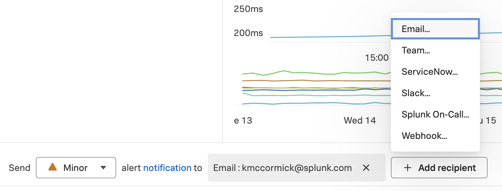
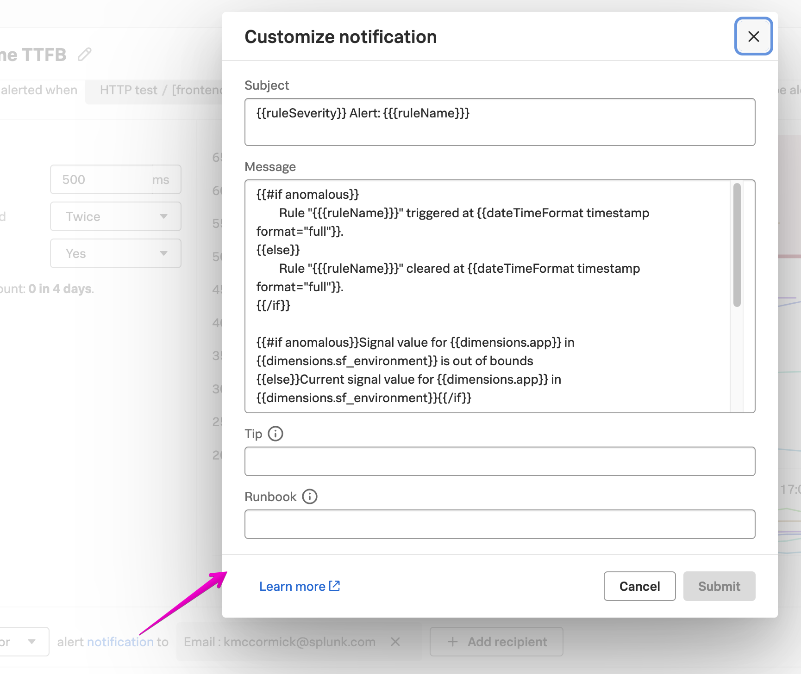

Why would we want a [detector on a single Synthetic test](https://docs.splunk.com/observability/en/synthetics/test-config/synth-alerts.html)? Some examples:
- The endpoint, API transaction, or browser journey is highly critical
- We have deployed code changes and want to know if the resulting KPI is or is not as we expect
- We need to temporarily keep a close eye on a specific change we are testing and don't want to create a lot of noise, and will disable the detector later

1. On the test overview page, click {}Create Detector{} on the top right.

1. Name the detector with your **team name** and your **initials** and **LCP** (the signal we will eventually use), so that the instructor can better keep track of everyone's progress.

1. Change the signal to First byte time.

1. Change the alert details, and see how the chart to the right shows the amount of alert events under those conditions. This is where you can decide how much alert noise you want to generate, based on how much your team tolerates. Play with the settings to see how they affect estimated alert noise.

1. Now, **change the signal to Largest contentful paint**. This is a key web vital related to the user experience as it relates to loading time. Change the threshold to **2500ms**. It's okay if there is no sample alert event in the detector preview.

1. Scroll down in this window to see the notification options, including severity and recipients.

1. Click the notifications link to customize the alert subject, message, tip, and runbook link.

1. When you are happy with the amount of alert noise this detector would generate, click Activate.
