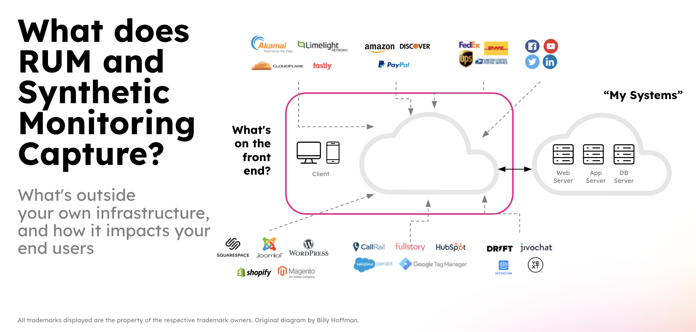

{}Sarah Ware{}

How can we use Splunk Observability to get insight into end user experience, and proactively test scenarios to improve that experience?

Sections:

- Set up basic [Synthetic tests](./1-synthetics/_index.md) to understand availability and performance ASAP
   - Uptime test
   - API test
   - Single page Browser test
- Explore [RUM](./2-rum/_index.md) to understand our real users
- Write [advanced Synthetics tests](./3-advanced-synthetics/_index.md) based on what we've learned about our users and what we need them to do
- Customize [dashboard charts](./4-dashboards/_index.md) to capture our KPIs, show trends, and show data in context of our events
- Create [Detectors](./5-detectors/_index.md) to alert on our KPIs

{}Keep in mind throughout the workshop: how can I prioritize activities strategically to get the fastest time to value for my end users and for myself/ my developers?{}

## Context

As a reminder, we need frontend performance monitoring to capture everything that goes into our end user experience. If we're just monitoring the backend, we're missing all of the other resources that are critical to our users' success. Read [What the Fastly Outage Can Teach Us About Observability](https://www.splunk.com/en_us/blog/devops/what-the-fastly-outage-can-teach-us-about-observability.html) for a real world example. Click the image below to zoom in.

## References

Throughout this workshop, we will see references to resources to help further understand end user experience and how to optimize it. In addition to [Splunk Docs](https://docs.splunk.com/observability/en/rum/intro-to-rum.html) for supported features and [Lantern](https://lantern.splunk.com/Observability/UCE/Optimized_experiences) for tips and tricks, [Google's web.dev](https://web.dev/) and [Mozilla](https://developer.mozilla.org/en-US/docs/Learn/Performance) are great resources. 

Remember that the specific libraries, platforms, and CDNs you use often also have their own specific resources. For example [React](https://react.dev/reference/react/useCallback#skipping-re-rendering-of-components), [Wordpress](https://wpengine.com/support/troubleshooting-high-time-first-byte-ttfb/), and [Cloudflare](https://community.cloudflare.com/t/improving-time-to-first-byte-ttfb-with-cloudflare/390367) all have their own tips to improve performance.
