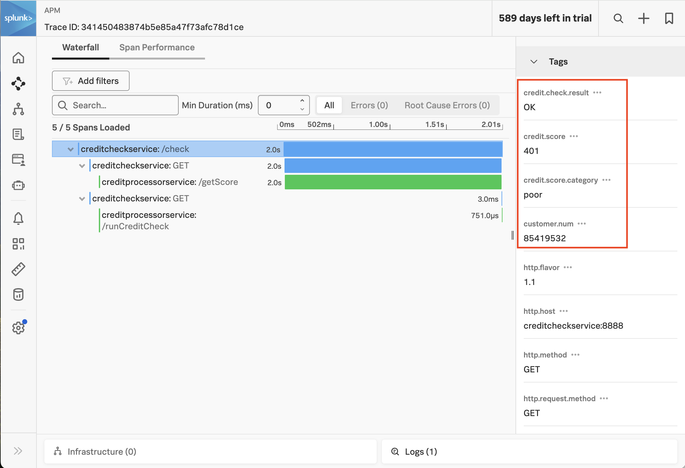

Let's add some tags to our traces, so we can find out why some customers receive a poor experience from our application.

## Identify Useful Tags

We'll start by reviewing the code for the `creditCheck` function of `creditcheckservice` (which can be found in the file `/home/splunk/workshop/tagging/creditcheckservice-java/src/main/java/com/example/creditcheckservice/CreditCheckController.java`):

```java
@GetMapping("/check")
public ResponseEntity<String> creditCheck(@RequestParam("customernum") String customerNum) {
    // Get Credit Score
    int creditScore;
    try {
        String creditScoreUrl = "http://creditprocessorservice:8899/getScore?customernum=" + customerNum;
        creditScore = Integer.parseInt(restTemplate.getForObject(creditScoreUrl, String.class));
    } catch (HttpClientErrorException e) {
        return ResponseEntity.status(HttpStatus.INTERNAL_SERVER_ERROR).body("Error getting credit score");
    }

    String creditScoreCategory = getCreditCategoryFromScore(creditScore);

    // Run Credit Check
    String creditCheckUrl = "http://creditprocessorservice:8899/runCreditCheck?customernum=" + customerNum + "&score=" + creditScore;
    String checkResult;
    try {
        checkResult = restTemplate.getForObject(creditCheckUrl, String.class);
    } catch (HttpClientErrorException e) {
        return ResponseEntity.status(HttpStatus.INTERNAL_SERVER_ERROR).body("Error running credit check");
    }

    return ResponseEntity.ok(checkResult);
}
```

We can see that this function accepts a **customer number** as an input.  This would be helpful to capture as part of a trace.  What else would be helpful?

Well, the **credit score** returned for this customer by the `creditprocessorservice` may be interesting (we want to ensure we don't capture any PII data though).  It would also be helpful to capture the **credit score category**, and the **credit check result**.

Great, we've identified four tags to capture from this service that could help with our investigation.  But how do we capture these?

## Capture Tags

We start by adding OpenTelemetry imports to the top of the `CreditCheckController.java` file:

```java
...
import io.opentelemetry.api.trace.Span;
import io.opentelemetry.instrumentation.annotations.WithSpan;
import io.opentelemetry.instrumentation.annotations.SpanAttribute;
```

Next, we use the `@WithSpan` annotation to produce a span for `creditCheck`:

```java
@GetMapping("/check")
@WithSpan // ADDED
public ResponseEntity<String> creditCheck(@RequestParam("customernum") String customerNum) {
    ...
```

We can now get a reference to the current span and add an attribute (aka tag) to it:

```java
...
try {
    String creditScoreUrl = "http://creditprocessorservice:8899/getScore?customernum=" + customerNum;
    creditScore = Integer.parseInt(restTemplate.getForObject(creditScoreUrl, String.class));
} catch (HttpClientErrorException e) {
    return ResponseEntity.status(HttpStatus.INTERNAL_SERVER_ERROR).body("Error getting credit score");
}
Span currentSpan = Span.current(); // ADDED
currentSpan.setAttribute("credit.score", creditScore); // ADDED
...
```

That was pretty easy, right?  Let's capture some more, with the final result looking like this:

```java
@GetMapping("/check")
@WithSpan
public ResponseEntity<String> creditCheck(@RequestParam("customernum")
                                          @SpanAttribute("customer.num")
                                          String customerNum) {
    // Get Credit Score
    int creditScore;
    try {
        String creditScoreUrl = "http://creditprocessorservice:8899/getScore?customernum=" + customerNum;
        creditScore = Integer.parseInt(restTemplate.getForObject(creditScoreUrl, String.class));
    } catch (HttpClientErrorException e) {
        return ResponseEntity.status(HttpStatus.INTERNAL_SERVER_ERROR).body("Error getting credit score");
    }
    Span currentSpan = Span.current();
    currentSpan.setAttribute("credit.score", creditScore);

    String creditScoreCategory = getCreditCategoryFromScore(creditScore);
    currentSpan.setAttribute("credit.score.category", creditScoreCategory);

    // Run Credit Check
    String creditCheckUrl = "http://creditprocessorservice:8899/runCreditCheck?customernum=" + customerNum + "&score=" + creditScore;
    String checkResult;
    try {
        checkResult = restTemplate.getForObject(creditCheckUrl, String.class);
    } catch (HttpClientErrorException e) {
        return ResponseEntity.status(HttpStatus.INTERNAL_SERVER_ERROR).body("Error running credit check");
    }
    currentSpan.setAttribute("credit.check.result", checkResult);

    return ResponseEntity.ok(checkResult);
}
```

## Redeploy Service

Once these changes are made, let's run the following script to rebuild the Docker image used for `creditcheckservice` and redeploy it to our Kubernetes cluster:

``` bash
./5-redeploy-creditcheckservice.sh java
```

## Confirm Tag is Captured Successfully

After a few minutes, return to **Splunk Observability Cloud** and load one of the latest traces to confirm that the tags were captured successfully (hint: sort by the timestamp to find the latest traces):

****

Well done, you've leveled up your OpenTelemetry game and have added context to traces using tags.

Next, we're ready to see how you can use these tags with **Splunk Observability Cloud**!
