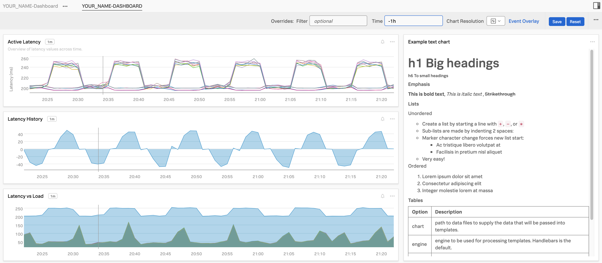
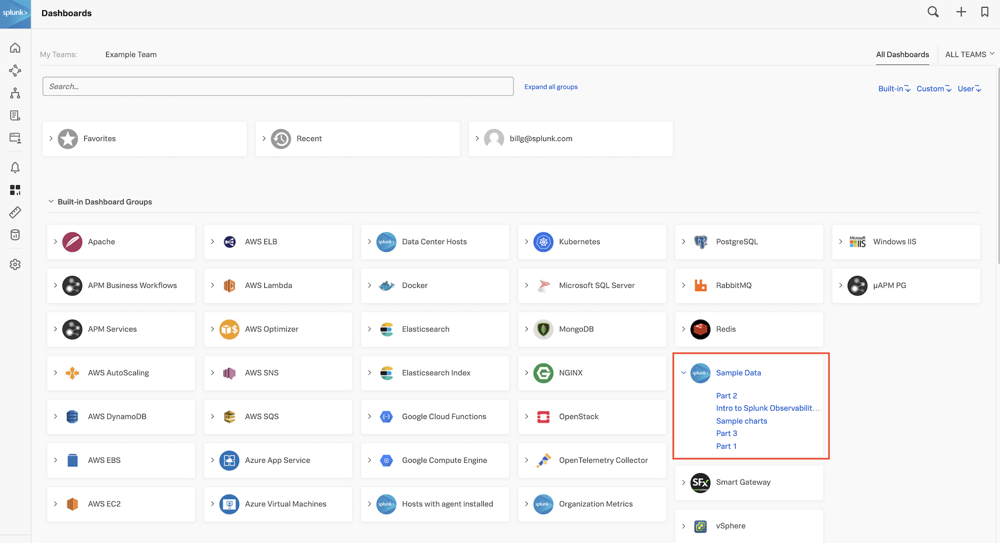

{}20 minutes{}

- Introduction to the Dashboards and charts
- Editing and creating charts
- Filtering and analytical functions
- Using formulas
- Saving charts in a dashboard
- Introduction to SignalFlow
  - {}**Ninja Mode**{} Monitoring as Code

---

## 1. Dashboards

Dashboards are groupings of charts and visualizations of metrics. Well-designed dashboards can provide useful and actionable insight into your system at a glance. Dashboards can be complex or contain just a few charts that drill down only into the data you want to see.

During this module we are going to create a dashboard with charts and connect it to your Team page.

## 2. Your Teams' Page

Click on the  from the navbar. As you have already been assigned to a team, you will land on the team dashboard. We use the ***Example Team*** as an example here. The one in your workshop will be different!

This page shows the total number of team members, how many active alerts for your team and all dashboards that are assigned to your team. Right now they are no dashboards assigned but as stated before, we will add the new dashboard that you will create to your Teams page later.

---

## 3. Sample Charts

To continue, click on **All Dashboards** on the top right corner of the screen.
This brings you to the view that shows all the available dashboards, including the pre-built ones.

If you are already receiving metrics from a Cloud API integration or another service through the Splunk Agent you will see relevant dashboards for these services.

---

## 4. Inspecting the Sample Data

Among the dashboards you will see a Dashboard group called **Sample Data**. Expand the **Sample Data** dashboard group by clicking on it, and then click on the **Sample Charts** dashboard.

In the Sample Charts dashboard you can see a selection of charts that show a sample of the various styles, colors and formats you can apply to your charts in the dashboards.

Have a look through all the dashboards in this dashboard group (**PART 1**, **PART 2**, **PART 3** and **INTRO TO SPLUNK OBSERVABILITY CLOUD**)

