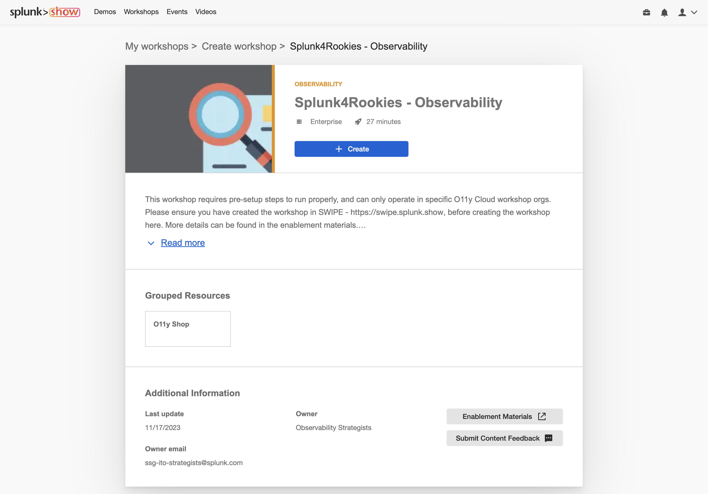

##### **Provision EC2 Instances Using Splunk Show**

<!---->

To set up your workshop environment, visit [**Splunk Show**](https://show.splunk.com/) and provision your EC2 instances using the appropriate Observability Workshop template.

---

##### **Choose the Right Workshop Template**

Splunk Show offers two templates for Observability workshops. Select the one that best fits your needs:

##### **1. Splunk4Rookies - Observability**  

- **Use this template** to run the **Splunk4Rookies - Observability Cloud Workshop**.  
- This template pre-deploys the **OpenTelemetry Collector** and the **Online Boutique application**.  
- Attendees only need a browser to complete the workshop.  

##### **2. Splunk4Ninjas - Observability**  

- **Use this template** for advanced (Ninja) workshops.  
- This template creates an instance with everything required for hands-on activities, such as installing OpenTelemetry and deploying applications.  
- Select the appropriate event type: **Normal Workshop**, **Private Event**, or **Public Event**.  
- Set the **Estimated Participants** to the number of attendees you expect, and match this value in the **O11y Shop Quantity** field.  
  - **Tip:** Over-provision by **10% - 20%** to accommodate last-minute attendees.  

---

##### **Important Configuration Tips**

When provisioning your instances, keep the following in mind:

1. **Operating Hours**  
   - Set **Operating hours** to **Run always (24/7)**.  
   - This prevents the instance from being suspended, which could result in a new IP address and break RUM and Synthetics configurations.  

2. **DNS Name**  
   - Assign a **DNS name** to the instance(s).  
   - This makes it easier to locate and manage environments in Splunk Observability Cloud during the workshop.  

3. **Splunk Observability Cloud Realm and SWiPE ID**  
   - Select your Splunk Observability Cloud **Realm**.  
   - Enter the **SWiPE ID** generated for your workshop.  

---

### **Additional Resources**

For more detailed guidance on using Splunk Show, refer to the [**Splunk Show User Guide**](http://go/show/user-guide).
