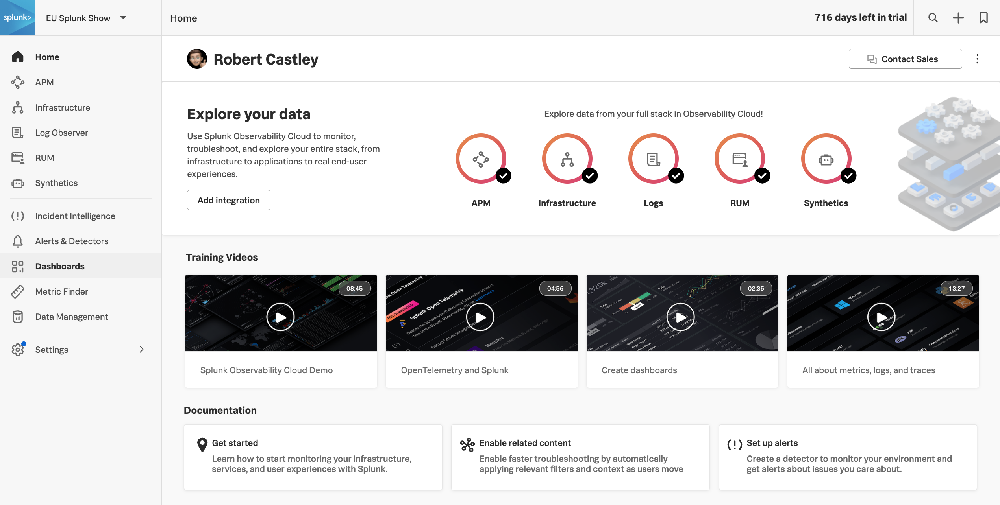
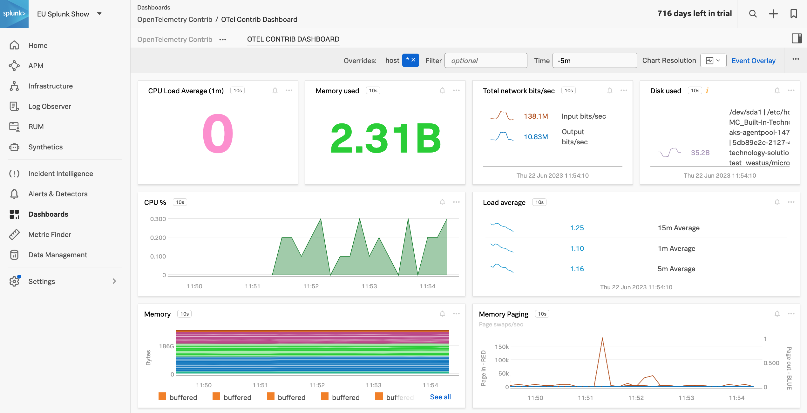
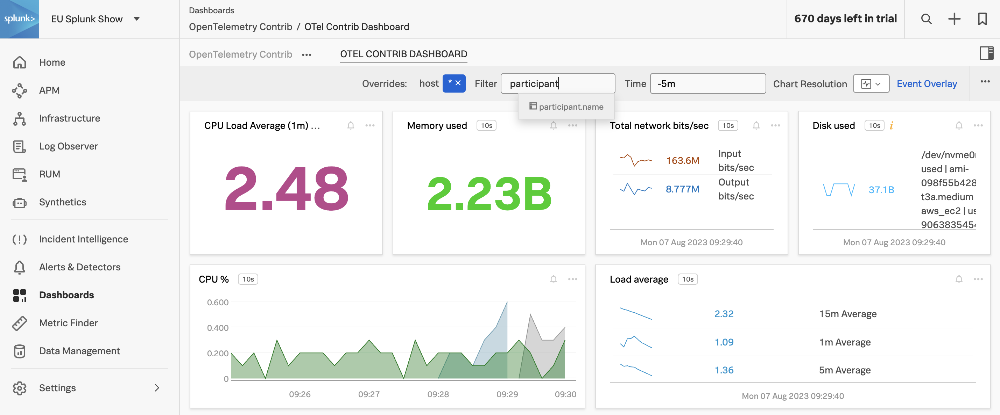
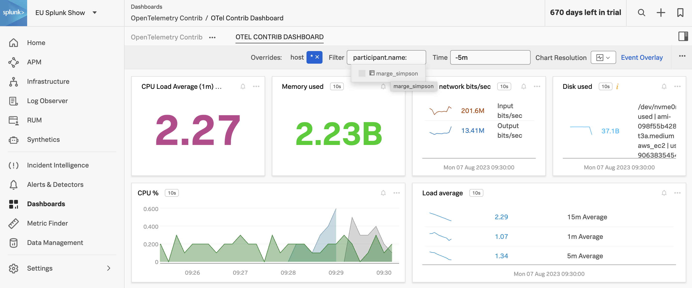

## Splunk Observability Cloud

OpenTelemetry Collector を設定して Splunk Observability Cloud にメトリクスを送信するようにしたので、Splunk Observability Cloud でデータを見てみましょう。Splunk Observability Cloud　への招待を受け取っていない場合は、講師がログイン資格情報を提供します。

その前に、もう少し興味深くするために、インスタンスでストレステストを実行しましょう。これにより、ダッシュボードが活性化されます。

``` bash
sudo apt install stress
while true; do stress -c 2 -t 40; stress -d 5 -t 40; stress -m 20 -t 40; done
```

Splunk Observability Cloudにログインしたら、左側のナビゲーションを使用して **Dashboards** に移動します：



検索ボックスで **OTel Contrib** を検索します：


{}
ダッシュボードが存在しない場合は、講師が迅速に追加します。このワークショップの Splunk 主催版に参加していない場合、インポートするダッシュボードグループはこのページの下部にあります。
{}

**OTel Contrib Dashboard** ダッシュボードをクリックして開きます：



ダッシュボードの上部にある **Filter** 欄に「participant」の途中まで入力し、候補に出る **participant.name** を選択します：



`participant.name` で、`config.yaml` 内で設定したあなたの名前を入力するか、リストから選択することができます：



これで、OpenTelemetry Collector を設定したホストの、ホストメトリクスを確認することができます。

{}
