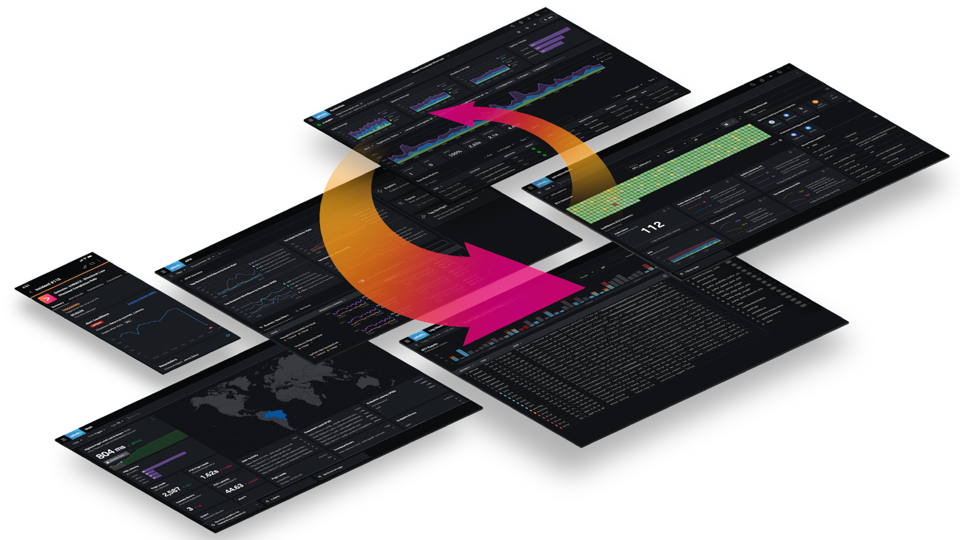

このワークショップでは、Splunk Observability Cloud がフロントエンドアプリケーションからバックエンドサービスまで、ユーザー体験に関する即時の可視性をどのように提供するかをデモンストレーションします。他の可観測性ソリューションと一線を画す、プラットフォームの最も強力な機能をいくつか体験していただきます：

- **インフラ監視（Infrastructure Monitoring）**
- **完全で忠実なリアルユーザーモニタリング（RUM）**
- **Application Performance Monitoring（APM）による End to End の NoSample で完全忠実なトレースの可視性**
- **コード入力を必要としないログクエリ**
- **外形監視・合成監視（Synthetic Monitoring）**
- **タグ分析とエラースタックによる根本原因分析**
- **Related Contents によるコンポーネント間のシームレスなナビゲーション**

Splunk Observability Cloud のコアとなる強みの一つは、テレメトリデータを統合し、エンドユーザーエクスペリエンスとアプリケーションスタック全体の包括的な全体像を作成する能力です。

このワークショップでは、AWS EC2 インスタンス上にデプロイされたマイクロサービスベースの e コマースアプリケーションに焦点を当てます。ユーザーは商品を閲覧し、カートに商品を追加し、注文を完了できます。このアプリケーションは、詳細なパフォーマンスデータを取得するために OpenTelemetry で計装されています。

**OpenTelemetry とは？**

[OpenTelemetry](https://opentelemetry.io/) は、メトリクス、トレース、ログなどのテレメトリデータの計装、生成、収集、エクスポートを支援するために設計されたオープンソースのツール、API、ソフトウェア開発キット（SDK）のコレクションです。このデータにより、ソフトウェアのパフォーマンスと動作の詳細な分析が可能になります。

OpenTelemetry コミュニティは急速に成長しており、Splunk、Google、Microsoft、Amazon などの大手企業からのサポートを受けています。現在、Cloud Native Computing Foundation において、Kubernetes に次いで 2 番目に多くのコントリビューターを抱えています。

