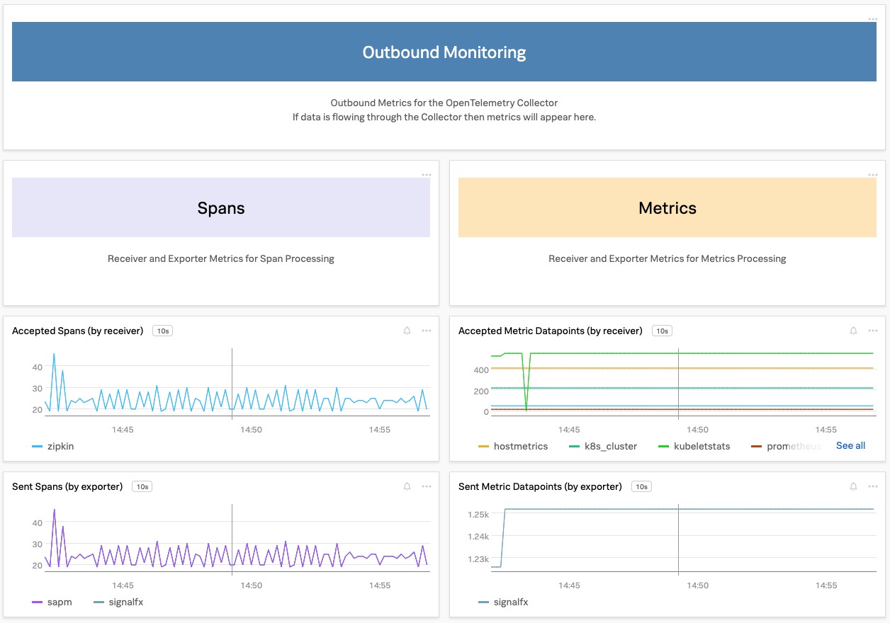

# OpenTelemetry Collector

OpenTelemetry Collectorは、スマートエージェントとSaaSインジェストの間にあるオプションのコンポーネントです。この構成では、トレースを受信するために `sapm` エンドポイントを使用しています。

## 1. helm で OpenTelemetry Collector をインストールする

まず、リポジトリを追加します。

=== "シェルコマンド"

    ```
    helm repo add open-telemetry https://open-telemetry.github.io/opentelemetry-helm-charts
    ```

つづいて、インストールします。

=== シェルコマンド

    ```
    helm install \
    --set standaloneCollector.configOverride.exporters.signalfx.realm=$REALM \
    --set standaloneCollector.configOverride.exporters.signalfx.access_token=$ACCESS_TOKEN \
    --set standaloneCollector.configOverride.exporters.sapm.access_token=$ACCESS_TOKEN \
    --set standaloneCollector.configOverride.exporters.sapm.endpoint=https://ingest.$REALM.signalfx.com/v2/trace \
    opentelemetry-collector open-telemetry/opentelemetry-collector \
    -f ~/workshop/otel/collector.yaml
    ```

## 2. OpenTelemetry Collectorのインストールを確認する

OpenTelemetry Collectorのログを確認します。

=== "シェルコマンド"

    ```bash
    kubectl logs -l app.kubernetes.io/name=opentelemetry-collector
    ```

その中から、次のようなログエントリを探します。

=== "出力例"

    ```text
    ... "msg":"Everything is ready. Begin running and processing data."}
    ```

サービスが実行されていて、ポート7276に`sapm`のエンドポイントがあることを検証します。

=== "シェルコマンド"

    ```
    kubectl get svc opentelemetry-collector
    ```

=== "出力例"

    ```
    NAME                      TYPE        CLUSTER-IP      EXTERNAL-IP   PORT(S)                                           AGE
    opentelemetry-collector   ClusterIP   10.43.119.140   <none>        14250/TCP,14268/TCP,55680/TCP,{==7276==}/TCP,9411/TCP   13m
    ```

healthcheckエンドポイントを使用して確認します。

=== "シェルコマンド"

    ```
    OTEL_ENDPOINT=$(kubectl get svc opentelemetry-collector -n default -o jsonpath='{.spec.clusterIP}')
    curl http://$OTEL_ENDPOINT:13133/; echo
    ```

=== "出力例"

    ```
    {"status":"Server available","upSince":"2020-10-22T08:07:33.656859114Z","uptime":"8m33.548333561s"}
    ```

## 3. OpenTelemetry Collector を使用するようにエージェントを再設定する

トレースを `sapm` 形式で送信し、OpenTelemetry Collector のトレースエンドポイントを指定していきましょう。

一旦、エージェントをアンインストールします。

=== "シェルコマンド"

    ```
    helm uninstall signalfx-agent
    ```

次に、`traceEndpointUrl` を OpenTelemetry Collector を指すように設定し、トレースフォーマットとして `sapm` を使用して、エージェントを再インストールします。

=== "シェルコマンド"

    ```
    helm install \
    --set writer.traceExportFormat=sapm \
    --set signalFxAccessToken=$ACCESS_TOKEN \
    --set clusterName=$(hostname)-k3s-cluster \
    --set kubeletAPI.url=https://localhost:10250 \
    --set signalFxRealm=$REALM \
    --set traceEndpointUrl=http://opentelemetry-collector:7276/v2/trace \
    --set gatherDockerMetrics=false \
    signalfx-agent signalfx/signalfx-agent \
    -f ~/workshop/k3s/values.yaml
    ```

OpenTelemetry Collector のダッシュボードを確認し、メトリクスとスパンが送信されていることを確認します。


