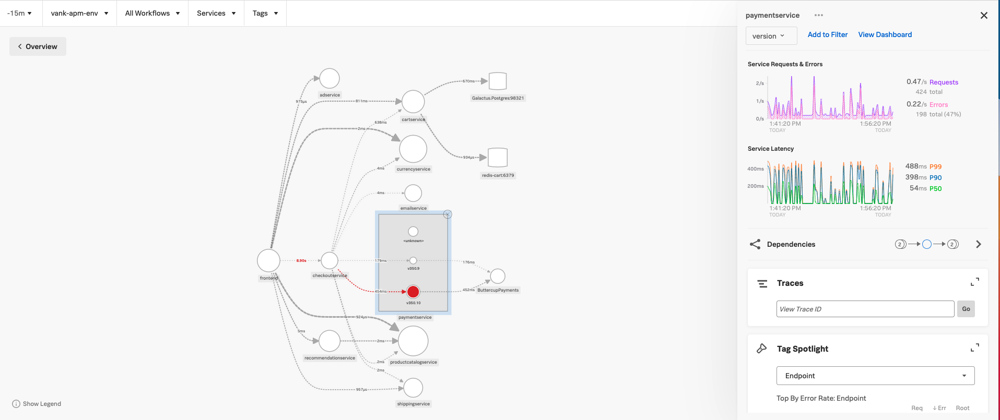

# Using Splunk APM

* APM Overview - RED metrics
* Using the Service Map
* Introduction to Tag Spotlight
* Example Traces
* Contextual Links to Infra

## 1. Traces and Spans explained

A trace is a collection of spans that share the same trace ID, representing a unique transaction handled by your application and its constituent services.

Each span has a name, representing the operation captured by this span, and a service name, representing within which service the operation took place.

Additionally, spans may reference another span as their parent, defining the relationships between the operations captured in the trace that were performed to process that transaction.

Each span contains a lot of information about the method, operation, or block of code that it captures, including:

* the operation name
* the start time of the operation with microsecond precision
* how long the operation took to execute, also with microsecond precision
* the logical name of the service on which the operation took place
* the IP address of the service instance on which the operation took place

## 2. Service Map

Click on PaymentService on the service map and select ‘version’ from the drop down filter underneath ‘Payment Service’. This will filter our service map by the custom span tag ‘version’

You will now see the service map has been updated like the below screenshot to show the different versions of the payment service.

## 3. Tag Spotlight

On the right hand side of the screen scroll down on ‘Tag Spotlight’ and select ‘Top Across All Indexed Tags’ from the dropdown. Once this has been selected click the arrows as indicated in the screenshot below.

The Tag Spotlight Page will be displayed. From this page you can view the top tags in your application and their corresponding error rates.

Note that for the version tag it appears that version 350.10 has a 100% error rate and for our tenant level tag it shows that all three tenants (Silver, Bronze & Gold) have errors present.

Explore the other tags and see what other insights you can derive from the tag spotlight page.

Go back to your service map by pressing the back button in your browser. Click anywhere on the pink line in the ‘Service Requests & Errors’ graph. Once selected you should see a list of example traces. Click on one of the example traces.

## 4. Example Trace

You should now see the entire trace along with the spans for the example trace that was selected. Spans which have errors are indicated by a red exclamation mark beside it.

 Click one of these to expand the span and see the associated metadata and some error details. Note that we are able to see that this error is caused by a 401 error and other useful information such as ‘tenant’ and ‘version’ is also displayed.

