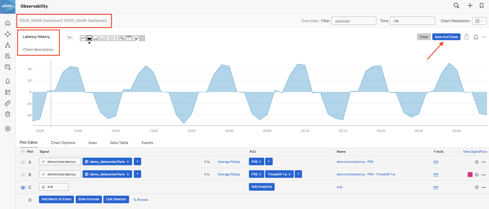
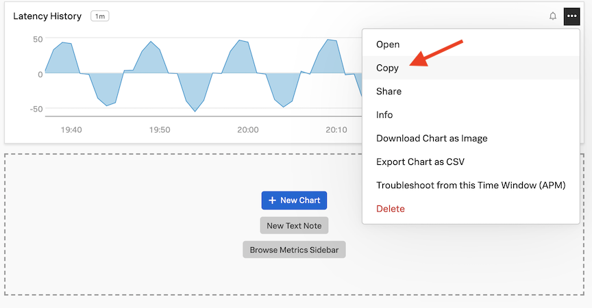
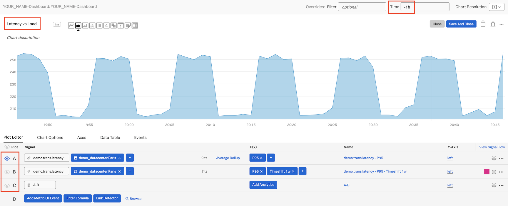

# Adding charts to dashboards

Let's now save our chart.

---
## 1. Saving an open chart to a dashboard
Check that you have **YOUR_NAME-Dashboard: YOUR_NAME-Dashboard** in the top right corner. 

This means you chart will be saved in this Dashboard.

Name the Chart **Latency History**  and add a Chart Description if you wish.

Click on **Save And Close**{: .label-button .sfx-ui-button-blue}. This returns you to your dashboard that now has two charts!

Now lets quickly add an other Chart based on the previous one.

---

## 2. Copy and Paste an existing chart
Click on the three dots **`...`** on the **Latency History** chart in your dashboard and then on **Copy** 

You  see the chart being copied, and  you should now have a red circle with a white 1 next to the **+** on the top left of the page. 

Click on the  at the top of the page, and then in the menu on *Paste Charts* (There should also be a red dot with a 1 visible at the end of the line).

This will place a copy of the previous chart in your dashboard.

---

## 3. Edit the pasted chart
Click on the three dots **`...`** on on of the **Latency History** charts in your dashboard and then on **Open** (or you can click on the name of the chart which here is **Latency History**).

This will bring you to the editor environement again.

First set the time for the chart to -1 hour in the Time box at the top right of the chart. Then to make this a different chart, click on the eye icon in front of signal "*A*" to make it visible again, and then hide signal "*C*" via the eye icon nd  change the name for *Latency history* to **Latency vs Load**. 

Click on the **Add Metric Or Event**{: .label-button .sfx-ui-button-blue} button.  this will bring up the box  for a new signal. Type and select ***demo.trans.count***  for Signal **D**.

This will add a new Signal **D** to your chart, It shows the number of active request active. Add the filter for the *demo_datacenter:Paris*.
then change the Rollup type by clicking on **Delta Rollup** (or clicking on the cog icon) 

When the visualisation pane opens. change the  Rollup  dropdown to  **Rollup:Rate/sec*** then when it changes to the chart below, make sure you have changed the name to **Latency vs load**  and press  the  **Save And Close**{: .label-button .sfx-ui-button-blue} button. This returns you to your dashboard that now has three different charts!

Lets add an "instruction" note  and arrange the charts!
