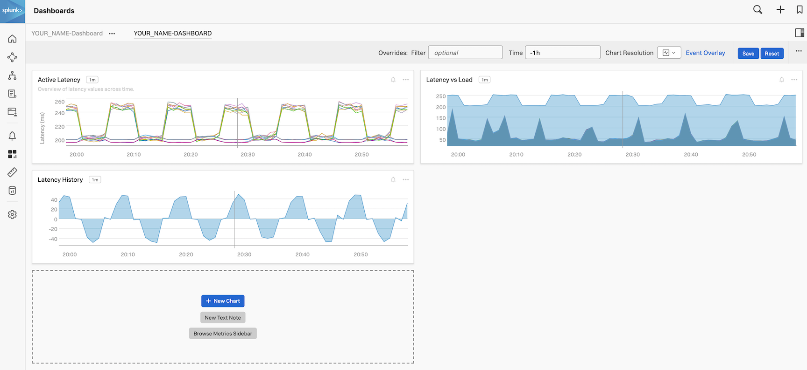

# Adding Notes and Dashboard Layout
## 1. Adding Notes
Often on dashboards it makes sense to place a short "instruction" pane that 
helps users of a dashboard.

Lets add on now by clicking on the **New Text Note** Button.


 
 This will 
Splunk is using  Makrdown for this.
Markdown is a lightweight markup language for creating formatted text using plain-text  often used in Webpages. Splunk uses this to allow you to create Nnformation Notes in dashboards.  

This includes:
* Headers. (in various sizes)
* Emphasis styles
 lists and Tables
* Links. Thi can be to other external webpages (documentation for example) or directly to Splunk IMT Dashboards

Below is an example of  above Markdown options you can use in your note.

=== "Sample Markdown text"

    ```text

    # h1 Big headings  
    ###### h6  To small headings

    ##### Emphasis

    **This is bold text**, *This is italic text* , ~~Strikethrough~~

    ##### Lists

    Unordered

    + Create a list by starting a line with `+`, `-`, or `*`
    - Sub-lists are made by indenting 2 spaces:
    - Marker character change forces new list start:
        * Ac tristique libero volutpat at
        + Facilisis in pretium nisl aliquet
    * Very easy!

    Ordered

    1. Lorem ipsum dolor sit amet
    2. Consectetur adipiscing elit
    3. Integer molestie lorem at massa

    ##### Tables

    | Option | Description |
    | ------ | ----------- |
    | data   | path to data files to supply the data that will be passed into templates. |
    | engine | engine to be used for processing templates. Handlebars is the default. |
    | ext    | extension to be used for dest files. |

    #### Links

    [link to webpage](https://www.splunk.com)

    [link to dashboard with title](https://app.eu0.signalfx.com/#/dashboard/EaJHrbPAEAA?groupId=EaJHgrsAIAA&configId=EaJHsHzAEAA"Link to the Sample chart Dashboard!")
    ```
Copy the above by using the copy button and paste it in the  *Edit* box.
the preview will show you how it will look. 

## 2. Saving our chart