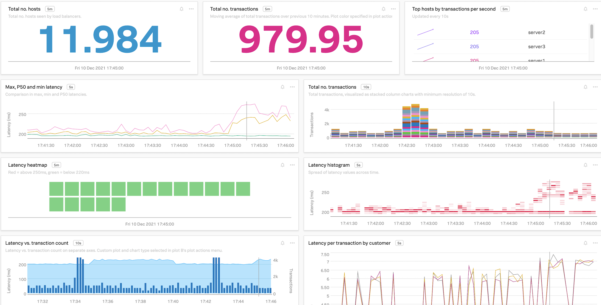
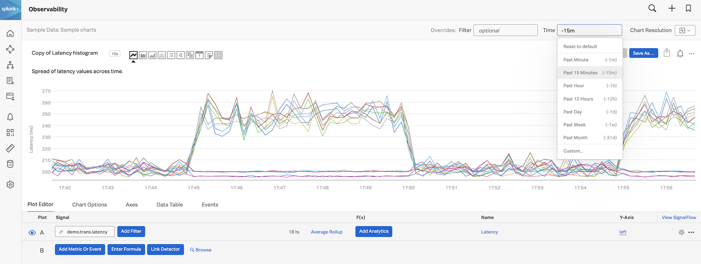

# Editing charts

## 1. Editing a chart

Click on the three dots **`...`** on the **Latency histogram** chart in the **Sample Data** dashboard and then on **Open** (or you can click on the name of the chart which here is **Latency histogram**).

You will see the plot options, current plot and signal (metric) for the **Latency histogram** chart in the chart editor UI.

In the **Plot Editor** tab under **Signal** you see the metric **`demo.trans.latency`** we are currently plotting.

You will see a number of **Line** plots. The number **`18 ts`** indicates that we are plotting 18 metric time series in the chart.

Click on the different chart type icons to explore each of the visualizations. Notice their name while you swipe over them. For example, click on the Heat Map icon:

See how the chart changes to a heat map.

!!! note
    You can use different charts to visualize your metrics - you choose which chart type fits best for the visualization you want to have.

    For more info on the different chart types see [Choosing a chart type](https://docs.signalfx.com/en/latest/charts/chart-planning-creating.html#choosing-a-chart-type){: target=_blank}.

Click on the **Line** chart type and you will see the line plot.

## 2. Changing the time window

You can also increase the time window of the chart by changing the time to **Past 15 minutes** by selecting from the **Time** dropdown.

## 3. Viewing the Data Table

Click on the **Data Table** tab.

You now see 18 rows, each representing a metric time series with a number of columns. These columns represent the dimensions of the metric. The dimensions for `demo.trans.latency` are:

- `demo_datacenter`
- `demo_customer`
- `demo_host`

In the **`demo_datacenter`** column you see that there are two data centers, **Paris** and **Tokyo**, for which we are getting metrics.

If you move your cursor over the lines in the chart horizontally you will see the data table update accordingly. If you click on one of the lines in the chart you will see a pinned value appear in the data table.

---

Now click on **Plot editor** again to close the Data Table and let's save this chart into a dashboard for later use!

