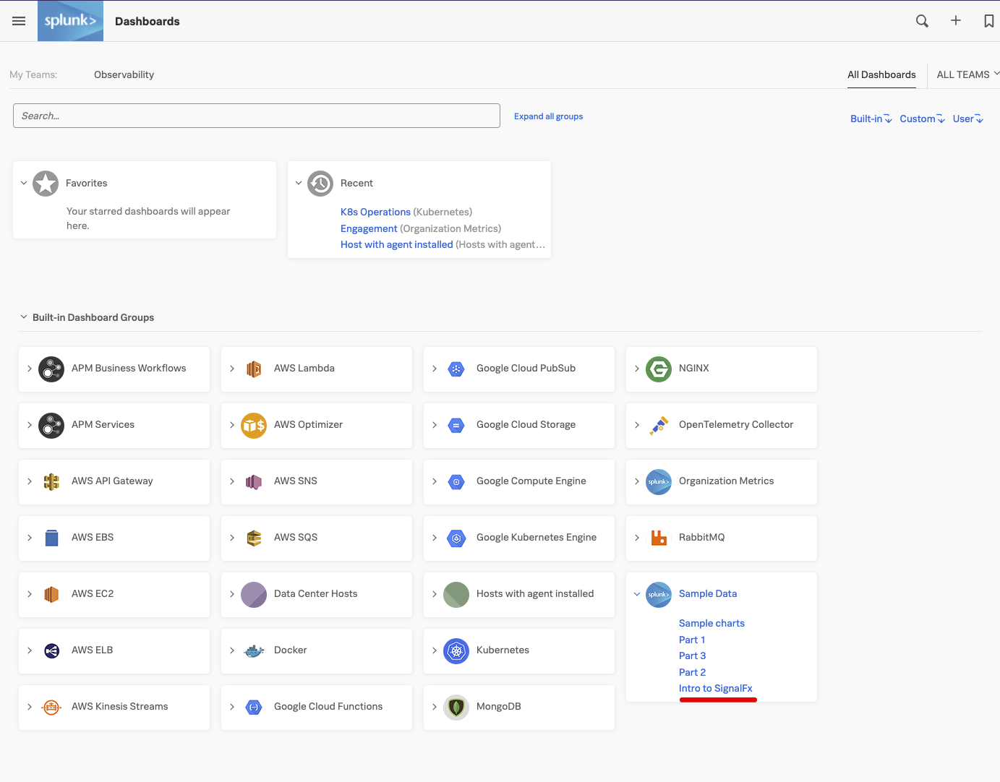

# Working with Dashboards, Charts and Metrics

* Introduction to the Dashboards and charts
* Editing and creating charts
* Filtering and analytical functions
* Using formulas
* Saving charts in a dashboard
* Introduction to SignalFlow

---

## 1. Introduction to the Observability Suite UI

Logon to the Organization you have been invited to.

You can find all the dashboards from the top left hamburger menu     then selecting **Dashboards** from the side menu. 

This will bring you to your teams dashboard, We use the team Observability as an example here . 

It shows the total number of team members, how many alerts are there for your team and all dashboards that are assigned to your team.

To continue, click on **All Dashboards** on the top right corner of the screen.
This brings you to the a view that shows  all the available  dashboards, included the prebuilt ones 

If you are already receiving metrics from a Cloud API integration or another service through the Splunk Agent you will see relevant dashboards for these services.

Among the dashboards you will see a Dashboard group called **Sample Data**. Let's take a closer look at it!

---

## 2. Inspecting the Sample Data

In this dashboard view expand the **Sample Data** dashboard group by clicking on it, and then click on the **Intro to SignalFx** dashboard.

You will see a selection of sample charts. To learn more about charts you can click on the other sample dashboards (**PART 1**, **PART 2** and **PART 3**).

Let's take a look at the Sample charts.

Click on the **SAMPLE CHARTS** dashboard name.

In the Sample Charts dashboard you can see a selection of charts that show a sample of the various styles, colors and formats you can apply to your charts in the dashboards.

