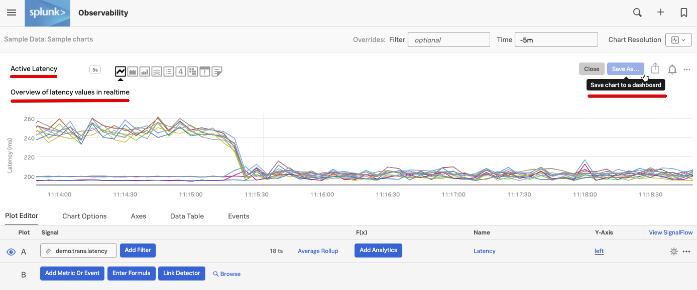
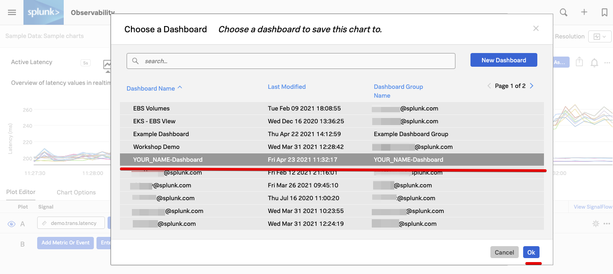

# Saving charts

## 1 Creating your own dashboard

Let's save this chart into a dashboard for later use!

Click on **Plot editor** again to close the Data Table and change the name of the Dashboard from "*Copy of Latency histogram*" to **"Active Latency"**.

Change the description from "*Spread of latency values across time.*" to **"Overview of latency values in realtime"** 

Press the Save As Button to begin saving your chart.

Make sure your chart has a name, it will use he name you have given it in the previous step, but you can edit it here if needed.

Press the Ok button to continue.

This will show you the Choose dasboard dialog. Aswe are going to create a new dahsboard, click on the new Dashboard button.

You will now see the **New DashBoard** Dialog.

In here you can give you dashboard a Name and Desciption, and set some edit priviliges.

Please use your onw name in the following format to name you dashboard :

**YOUR_NAME-Dashboard** Please replace YOUR_NAME with your name.
Remove the tick from the *Anyone in this organization can edit* tick box.
You now have the option to add other users or team that may edit your dahsboard and charts.

For now press the Ok Button to continue

Let's enter a metric to plot. We are going to use the metric **`demo.trans.latency`**.

In the **Plot Editor** tab under **Signal** enter **`demo.trans.latency`**.

You will instantly see a number of **Line** plots, like below. The number **`18 ts`** indicates that we are plotting 18 metric time series in the chart.

You also want to increase the time window of the chart by changing the **Time** to *-15m* by seleciting it from the **Time** dropdown in the upper right corner

Click on the **DATA TABLE** tab.

You see now 18 rows, each representing a metics time series with a number of columns. If you swipe over the plot horizontally you will see the metrics in these columns at different times.

In the **`demo_datacenter`** column you see that there are two data centers, **Paris** and **Tokyo**, for which we are getting metrics.
