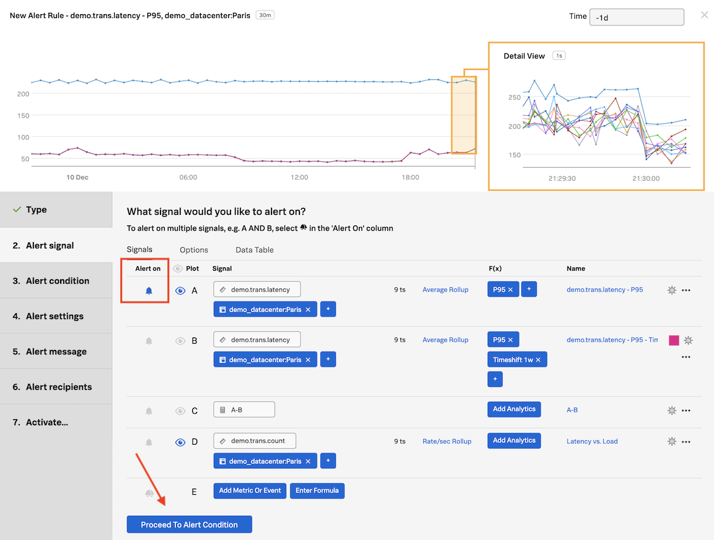
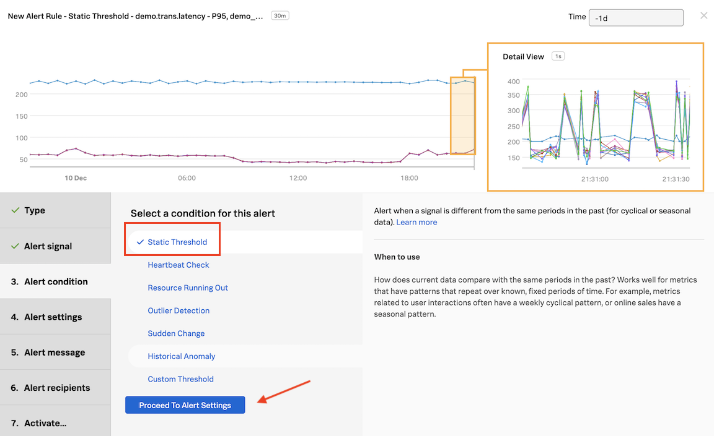
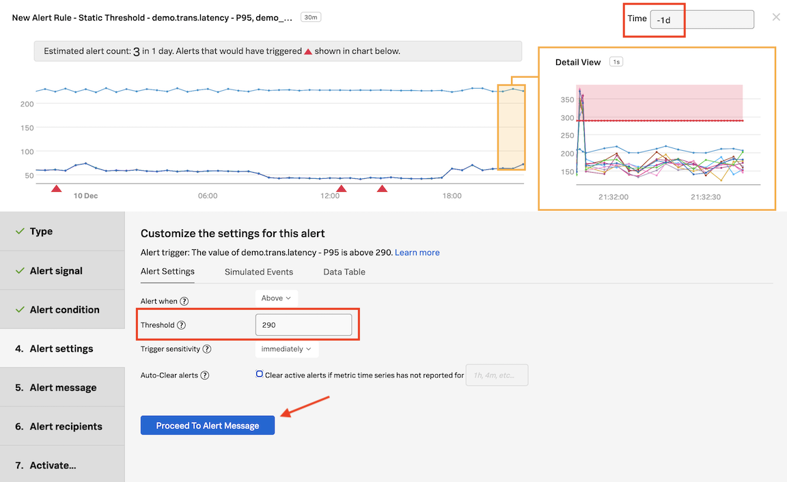
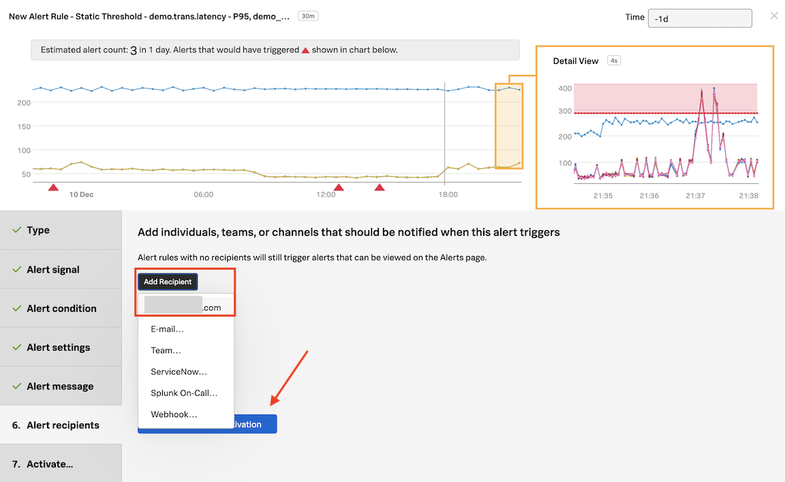

# ディテクターを使ってみよう - ラボ概要

* チャートからディテクターを作成する
* アラート条件を設定する
* プレフライトチェックを実行する
* ミューティングルールを設定する

---

## 1. はじめに

Splunk Observability Cloud では、ディテクター、イベント、アラート、通知を使用して、特定の条件が満たされたときに情報を提供します。たとえば、CPU 使用率が 95 パーセンタイルに達したときや、同時ユーザー数が制限値に近づき、追加の AWS インスタンスを立ち上げなければならない可能性があるときに、Slack チャンネルや Ops チームのメールアドレスにメッセージを送信したいとします。

これらの条件は1つまたは複数のルールとして表現され、ルール内の条件が満たされたときにアラートが発生します。ディテクターに含まれる個々のルールは、重要度に応じてラベル付けされています。Info、Warning、Minor、Major、Criticalとなっています。

## 2. ディテクターの作成

ダッシュボード**で、前のモジュールで作成した**カスタムダッシュボードグループ**をクリックし、ダッシュボードの名前をクリックします。

これから、このチャートから新しいディテクターを作成していきます。

チャートが表示されたら、チャート上のベルのアイコンをクリックし、「**New Detector From Chart**」をクリックします。

ディテクター名」の横にあるテキストフィールドで、提案されたディテクター名の前に「自分のイニシャル」を追加します。

重要な "Naming the detector"
    提案されたディテクター名の前に自分のイニシャルを追加することが重要です。
    それは次のようなものでなければなりません。**XYZのレイテンシーチャートディテクター**」。

Create Alert Rule**{: .label-button .sfx-ui-button-blue}をクリックします。

をクリックする。

Detectorウィンドウの**Alert signal**の中で、アラートするシグナルは**Alert on**欄に青のベルが表示されています。このベルは、どの信号がアラートの生成に使用されているかを示しています。

アラート条件への移行**{: .label-button .sfx-ui-button-blue}をクリックします。

---

## 3. アラート条件の設定

アラート条件**で、**静的しきい値**をクリックし、**アラート設定に進む**{: .label-button .sfx-ui-button-blue}をクリックしてください。

アラート設定**で、**Threshold**フィールドに値**`290`**を入力します。同じウィンドウで、右上の**Time**を過去1日(**-1d**)に変更します。

---

## 4. プリフライトチェックの警告

5秒後にプレフライトチェックが行われます。Estimated alert count**を参照してください。現在のアラート設定に基づくと、1日に受け取るアラートの量は約 **18** でした。

飛行前のチェックについて "の注意事項
    アラート条件を設定すると、UIは現在の設定に基づいて、右上に設定された時間枠（ここでは過去1日）の中で、どのくらいのアラートが発生するかを予測します。

    すぐに、プラットフォームは現在の設定でシグナルの分析を開始し、「プレフライトチェック」と呼ばれる作業を行います。これにより、プラットフォーム内の過去のデータを使用してアラート条件をテストし、設定が論理的であり、誤ってアラートストームを発生させないようにすることができます。Splunk Observability Cloud を使用してのみ利用できるシンプルかつ非常に強力な方法で、アラートの設定から推測作業を取り除くことができます。

    ディテクターのプレビューについての詳細は、以下のリンクをご覧ください。
    [ディテクターの設定](https://docs.signalfx.com/en/latest/detect-alert/set-up-detectors.html#previewing-the-results-of-a-detector){: target=_blank}をご覧ください。

**Proceed to Alert Message**{: .label-button .sfx-ui-button-blue}をクリックします。

---

## 5. アラートメッセージ

アラートメッセージ**の**Severity**で**Major**を選択します。

をクリックします。

Proceed to Alert Recipients**{: .label-button .sfx-ui-button-blue}をクリックします。

Add Recipient**（受信者の追加）をクリックし、最初の選択肢として表示されているメールアドレスをクリックします。

"Notification Services "をクリックしてください。
    これは、そのメールアドレスを入力したのと同じです。または、**E-mail...**をクリックして別のメールアドレスを入力することもできます。

    これは、スイートに用意されている多くの**通知サービス**の一例です。これを確認するには、トップメニューの**統合**タブに移動し、**通知サービス**を参照してください。

---

## 6. アラートの有効化

Alert Activationに進む**{: .label-button .sfx-ui-button-blue}をクリックします。

Activivate...**で **Activate Alert Rule**{: .label-button .sfx-ui-button-blue}をクリックします。

アラートをより早く取得したい場合は、**Alert Settings**をクリックして、値を**`290`**から**`280`**に下げてください。

Time**を**-1h**に変更すると、過去1時間のメトリクスに基づいて、選択した閾値でどれだけのアラートを取得できるかを確認できます。

トップメニューの**Alerts**にカーソルを合わせて、**Detectors**をクリックします。

ディテクター](../images/detectors/detectors-menu.png)をクリックします。

ディテクターのリストが表示されます。表示されない場合は、ブラウザを更新してください。

**おめでとうございます。最初のディテクターが作成され、起動されました。
