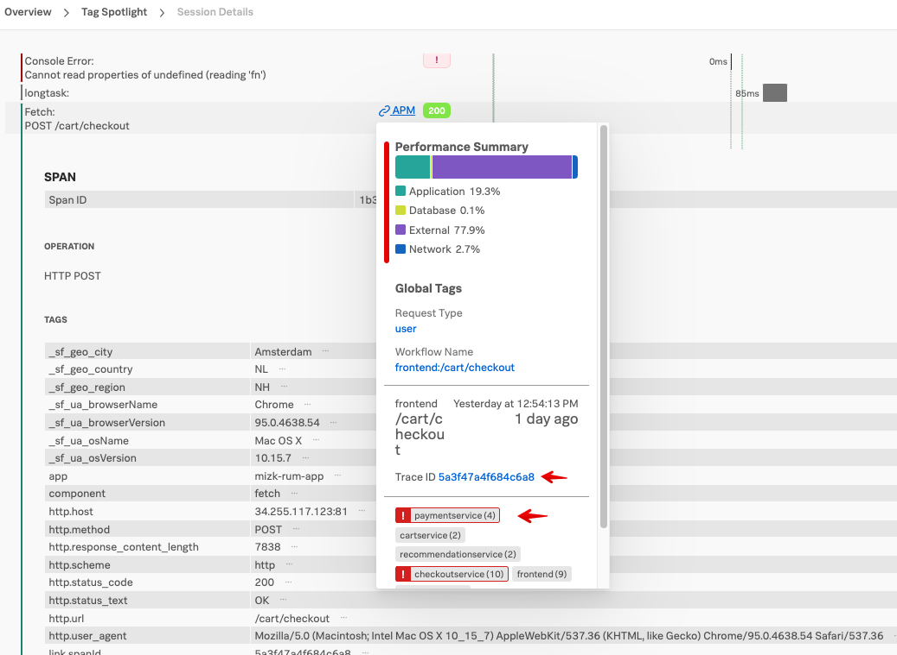
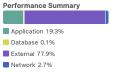

# Correlate Between Splunk RUM and APM

* Continue with the RUM Session information in the RUM UI
* See correlated APM traces and logs in the APM & Log Observer UI

---
## 1.  Validating the 

Click on the  to close the Span view.  
Now continue to scroll down and find the **POST /cart/checkout** line.

Click on the blue  link, this should pop a dialog showing information  on the backend services that where part of the checkout action taken by the end user.

In this popup, there are multiple sections available, providing you with a quick insight in the behavior of your backend services. For example the Performance Summary section will tell you where the time was spend during the backend call. 

In the above example you can see that more then 44% was spend in external services.

If you scroll down to the bottom of the dialog, so you can see the complete Trace and Services section like shown below:

