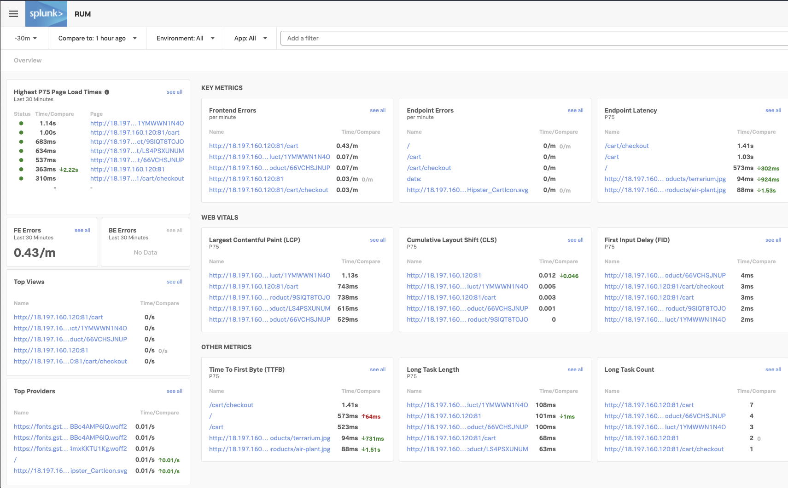
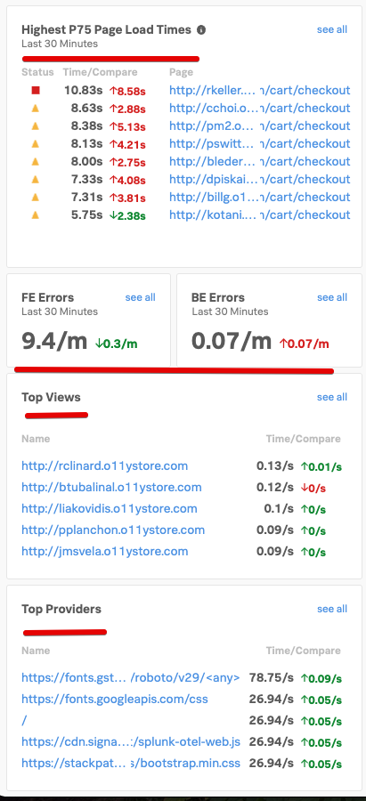
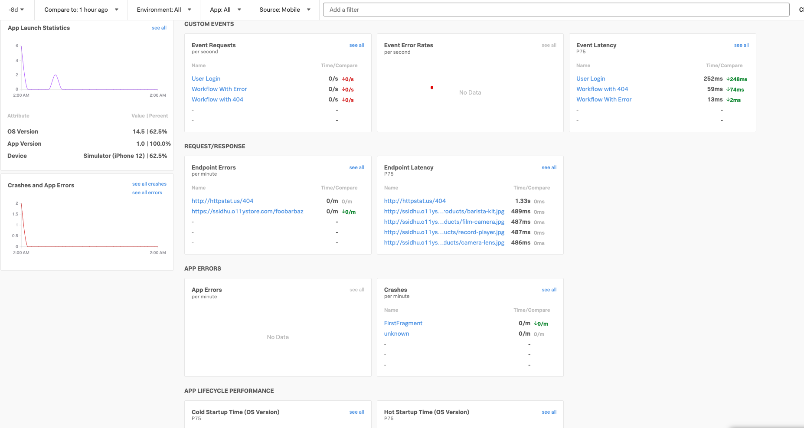

# Analyzing RUM Metrics

* See RUM Metrics and Session information in the  RUM UI
* See correlated APM traces in the RUM & APM UI

---
## 1. Visit the RUM overview pages

Visit and login into your Splunk IMT/APM/RUM Website.

From the top left hamburger menu  select **RUM** from the side menu.

This will bring you to the RUM user interface.

---
## 2. Explore the RUM Browser Overview Page

### 2.1. Header

The RUM UI Consist of 6 major sections,starting with the selection header,
here you can set/filter a number of options:  

* A drop down for the time window your reviewing (You are looking to the last 30 minutes in this case) 
* A drop down to select the Comparison window (You are comparing current performance on a rolling window    - in this case compared to 1 hour ago) 
* A drop down with the available Environments to view:  (Choose the one provided by the workshop host or *All* like in the example) 
* A drop down list with the Various Web apps (You can use the one provide by the workshop host or use *All*) 
* ***Optionally*** a drop down to select Browser or Mobile metrics (*Might not be available in your workshop*) 

### 2.2. Overview Pane
The next section is the overview pane:
This pane will give you a quick indication to the pages with highest increase in load times (75 percentile or higher)   
The **Highest P75 Page Load Times** window will show you in a quick view if the load time of  your top pages has increased or has an error.

In the example here you can see that the first page has an error due to the red square, and you can see that the load time has drastically increase  with more the 8 seconds.

You also see a overview of the number of Front end Error and Backend Errors  per minute.

The last two panes show you the top page view  and the top providers

### 2.3. Custom Event Pane
The Custom Event View is the location where you will find the metrics for any event you may have added yourself to the web pages you are monitoring. 
These are often added to pieces of custom code that are not part of a frame work or an event you created so you can better understand the flow though your application. 
We support **Event Request rate**, **Event Error Rates** and **Event Latency** metrics.

### 2.4. Key Metrics Pane
The Key Metrics View is the location where you will find the metrics for the number of  
**Frontend Errors** per second, **Endpoint Errors** per second an the **Endpoint Latency**. 
These Metrics are very useful to guide you to the location of an issue if you are experience problems with your site. 

### 2.5. Web Vitals Pane
The Web Vitals view is the location where you got if you wish to get insight in the experience you delivering to your End users based on Web Vitals metrics. 
Web Vitals is an initiative by Google to provide unified guidance for quality signals that are essential to delivering a great user experience on the web and focusses on three key parameters:

* Largest Contentful Paint (LCP): measures loading performance. To provide a good user experience, LCP should occur within 2.5 seconds of when the page first starts loading.
* First Input Delay (FID): measures interactivity. To provide a good user experience, pages should have a FID of 100 milliseconds or less.
* Cumulative Layout Shift (CLS): measures visual stability. To provide a good user experience, pages should maintain a CLS of 0.1. or less.

### 2.6. Other Metrics Pane

---
## 2. Explore the RUM Mobile Overview Page

