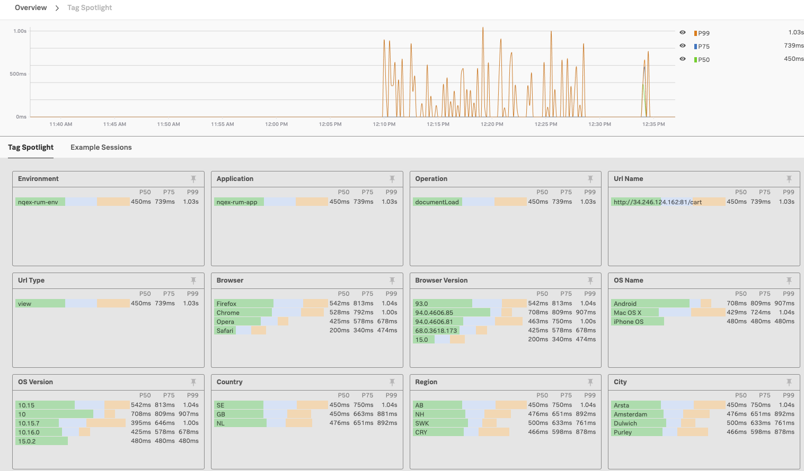
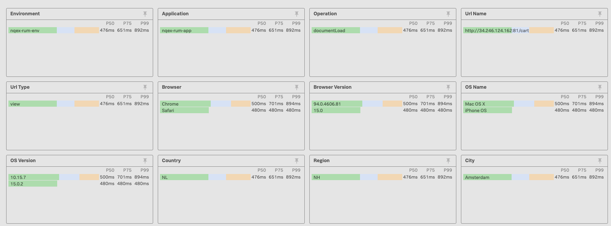
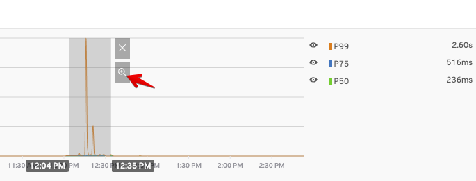

# Analyzing RUM Tags in the Tag Spotlight view

* Look into the Metrics views for the various endpoints and use the Tags send for deeper analysis

---
## 1. Find an url for the Cart endpoint

Form the RUm Overview page, please select the url for the cart endpoint to dive deeper into the information available for this end point. 

Once you have selected the url and clicked on the blue url, you will find yourself in the Tag spotlight overview 

Here you see all the tags that have been send to Splunk Rum as part of the RUM traces relevant to the overview you have selected. These are generic TAG created automatically when the the Trace was send, and Tags you have added to the  trace as part of the config of your website.

In our example the we have selected the **Document Load Latency** view as show here:

You can select any of the follow Tag views, each focused on a specific metric.

---
## 2. Explore the information in the Tag Spotlight view.
The Tag spotlight is designed to help you identify  problems, either though the chart view,, where you may quickly identify outliers or via the TAGs.

In the **Document Load Latency** view, if you look at the **Browser**, **Browser Version** & **OS Name** Tag views,you can see the various browser types and  versions. as well as the underlying OS.

This makes it easy to identify problems related to specific browser version, as they would show.

In the above example you can see that Firefox had the slowest response,  various Browser versions ( Chrome) that have different response times  and the slow response of the Android devices.

A further example are the regional Tags that you can use to identify problems related to ISP or locations  etc.

Here you should be able to find the location you have been using to access the Online Boutique.

Drill down by selecting  the town or country you are access the Online Boutique from by clicking on the name as shown below (City of Amsterdam):

This will select only the traces relevant to the city selected as show below:

By selecting the various Tag you build up a filter, you can see the current selection  below

To clear the filter and see every trace click on **Clear All** at the top right of the page.

If the over view page  is empty or shows , no traces have been recieved in the selected times lot. You need to increase the time window at the top left.  You can start with  the *Last 12 hours* for example.

You can then use you mouse to select a the time slot you want like show in the view below and  active that time filter by clicking on the little spy glass icon

