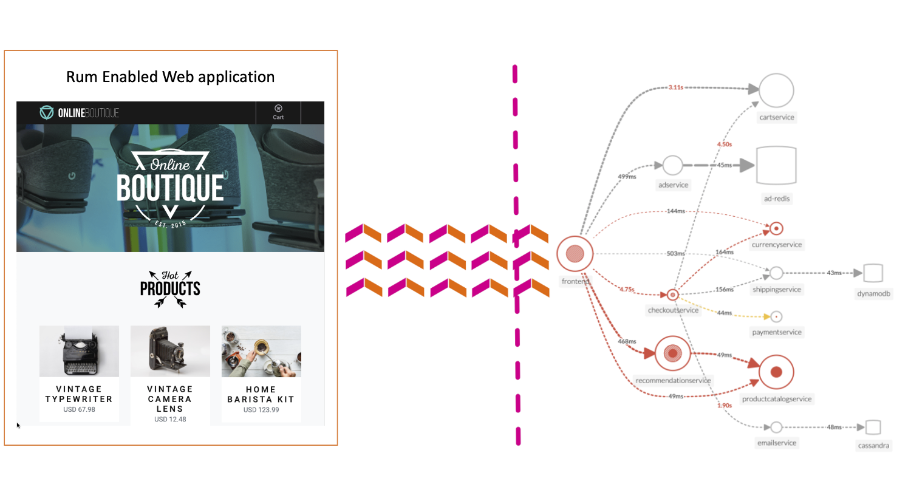

# Introduction

Splunk RUM is the industry’s only end to end, full fidelity Real User Monitoring solution, built to optimize performance and troubleshoot faster,giving you full visibility into end-user experiences.  What this means is that you can view the latency for all interactions from your app running in clients web browsers, through your database calls and everything in between. Identify performance problems in your page loads, and measure how slow backend service performance impacts your customer experience.
  
We support benchmarking and improving page performance with core web vitals, W3C timings,the ability to identifying long running tasks, and everything that impacts your page load   
And for data, we don’t sample, we’re framework agnostic, we’re OpenTelemetry standardized, and we capture full user sessions. 
All of this means you can measure all user interactions and dynamic components of your modern applications.
  
Similar to Splunk APM, the frontend and back end application performance are interdependent. To see the full picture, Splunk RUM provides seamless correlation between your front end and the back end microservices.  If your web based application acts out because of an issue related to the microservices, or the infra structure they are running on, Splunk will let you know.   To complete the picture, in-context access to Splunk logs and events enable deeper troubleshooting and root-cause analysis.
 
 

## Setup of your Instance (Optional)

If you are running this session as part of an IMT/APM/RUM Workshop or if you haven't been assigned an EC2 instance as part of a RUM workshop you can continue to to next section: [Example of RUM Beacon enablement in your Website](../rum/RUM-Setup/)

Please verify with your Host if the below steps are required:

* To configure the Open Telemetry collector/agent on your instance please visit: [Installing the Open Telemetry Collector/agent](../otel/k3s/)
* To Install the Online-Boutique website and services we use for APM and RUM visit: [Install the Online-Boutique](../apm/online-boutique/)

Continue to the next section once you have configured your environment: [Example of RUM Beacon enablement in your Website](../rum/RUM-Setup/)
