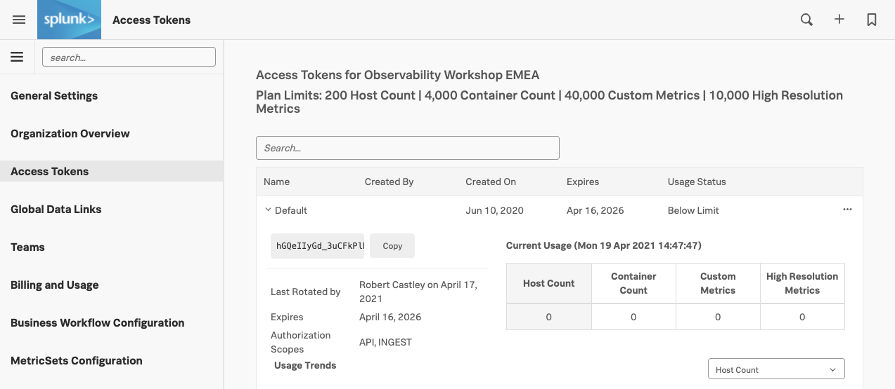
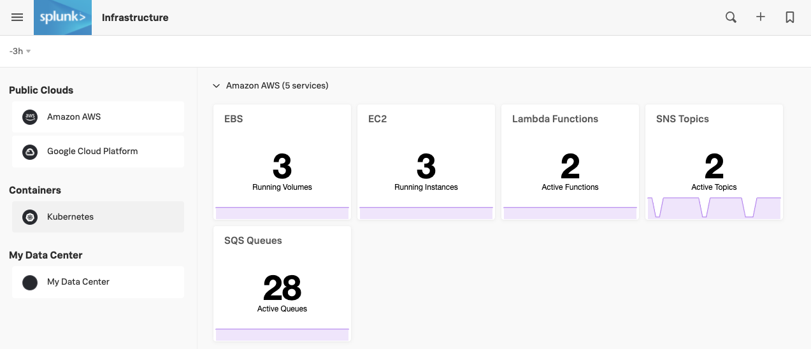
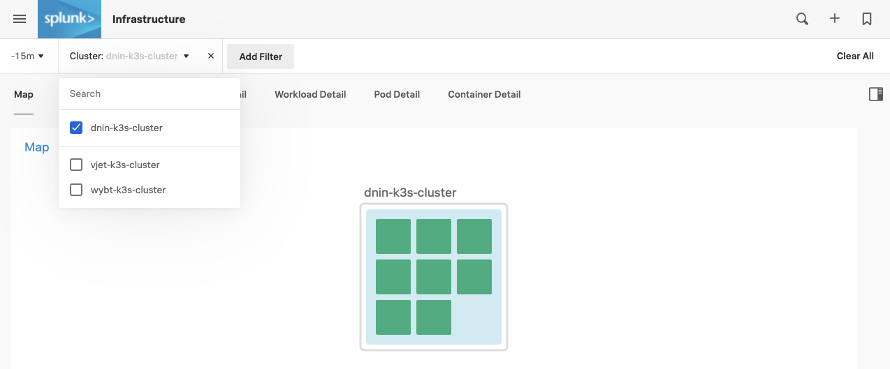
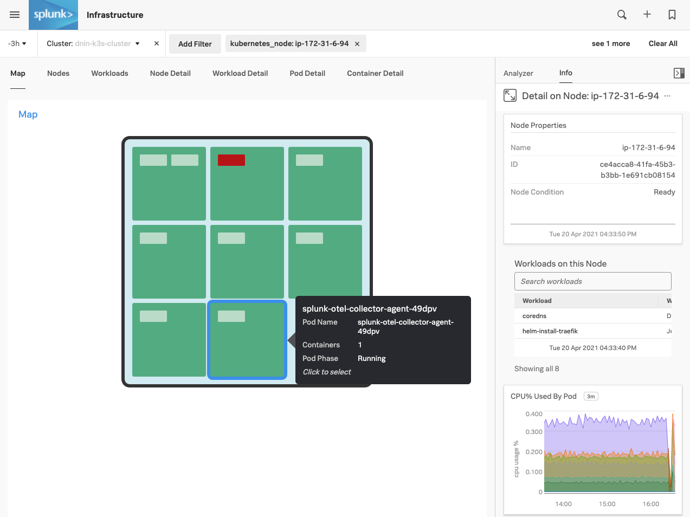

# Deploying the Smart Agent/OpenTelemetry Collector in Kubernetes

* Use the Splunk Helm chart to install the Smart Agent or OpenTelemetry Collector in K3s
* Explore your cluster in the Kubernetes Navigator

---

## 1. Obtain Splunk Access Token

You will need to obtain your Access Token[^1] from the Splunk UI once Kubernetes is running.

You can find your Access Token from the top left hamburger menu then selecting **Organization Settings → Access Tokens**.

Expand the **Default** token, then click on **Show Token** to expose your token. Click the **Copy**{: .label-button  .sfx-ui-button-grey} button to copy to clipboard.



You will also need to obtain the name of the Realm[^2] for your Splunk account.  From the hamburger menu, click on your name and select **Account Settings**.

The Realm can be found in the middle of the page within the Organizations section.  In this example it is `us0`.


---

## 2. Installation using Helm

Create the `ACCESS_TOKEN` and `REALM` environment variables to use in the proceeding Helm install command. For instance, if your realm is `us1`, you would type `export REALM=us1` and for `eu0` type `export REALM=eu0`.

=== "Shell Command"

    ```
    export ACCESS_TOKEN=<replace_with_default_access_token>
    export REALM=<replace_with_splunk_realm>
    ```

Install the Smart Agent or OpenTelemetry Collector using the Splunk Helm chart. First, add the Splunk Helm chart repository to Helm and update.

=== "OpenTelemetry Collector"

    ```
    helm repo add splunk-otel-collector-chart https://signalfx.github.io/splunk-otel-collector-chart && helm repo update
    ```

=== "Smart Agent"

    ```
    helm repo add signalfx https://dl.signalfx.com/helm-repo && helm repo update
    ```

Install the Smart Agent Helm chart with the following commands, do **NOT** edit this:

=== "OpenTelemetry Collector"

    ```
    helm install splunk-otel-collector \
    --set="splunkRealm=$REALM" \
    --set="splunkAccessToken=$ACCESS_TOKEN" \
    --set="clusterName=$(hostname)-k3s-cluster" \
    --set="logsEnabled=false" \
    --set="image.otelcol.repository=quay.io/signalfx/splunk-otel-collector" \
    --set="image.otelcol.tag=0.24.3" \
    --set="environment=$(hostname)-apm-env" \
    splunk-otel-collector-chart/splunk-otel-collector \
    -f ~/workshop/k3s/otel-collector.yaml
    ```

=== "Smart Agent"

    ```
    export EXTERNAL_IP=$(curl -s http://checkip.amazonaws.com)
    helm install \
    --set signalFxAccessToken=$ACCESS_TOKEN \
    --set clusterName=$(hostname)-k3s-cluster \
    --set kubeletAPI.url=https://localhost:10250 \
    --set signalFxRealm=$REALM  \
    --set traceEndpointUrl=https://ingest.$REALM.signalfx.com/v2/trace \
    --set gatherDockerMetrics=false \
    --set globalDimensions.workshop_external_ip=$EXTERNAL_IP \
    signalfx-agent signalfx/signalfx-agent \
    -f ~/workshop/k3s/values.yaml
    ```

You can monitor the progress of the deployment by running `sudo kubectl get pods` which should typically report a new pod is up and running after about 30 seconds.

Ensure the status is reported as Running before continuing.

=== "Get Pods"

    ```text
    sudo kubectl get pods
    ```

=== "OpenTelemetry Collector Output"

    ```
    NAME                                                          READY   STATUS    RESTARTS   AGE
    splunk-otel-collector-agent-2sk6k                             0/1     Running   0          10s
    splunk-otel-collector-k8s-cluster-receiver-6956d4446f-gwnd7   0/1     Running   0          10s
    ```

=== "Smart Agent Output"

    ```
    NAME                   READY   STATUS    RESTARTS   AGE
    signalfx-agent-66tvr   1/1     Running   0          7s
    ```

!!! info "OpenTelemetry Collector Only"
    Use `sudo kubectl port-forward splunk-otel-collector-agent-t8hnt --address 0.0.0.0 :55679` to see `zpages` on desktop e.g.
    ```
    Forwarding from 0.0.0.0:36143 -> 55679
    ```
    Use the port reported to connect from desktop e.g. `http://node_ip:36143/debug/tracez`
    
Ensure there are no errors by tailing the logs from the OpenTelemetry Collector/Smart Agent Pod. Output should look similar to the log output shown in the Output tabs below.

Use the label set by the `helm` install to tail logs (You will need to press ++ctrl+c++ to exit). Or use the installed `k9s` terminal UI for bonus points!

=== "Open Telemetry Collector Log"

    ```
    sudo kubectl logs -l app=splunk-otel-collector -f
    ```

=== "Open Telemetry Collector Output"

    ```
    2021-03-21T16:11:10.900Z        INFO    service/service.go:364  Starting receivers...
    2021-03-21T16:11:10.900Z        INFO    builder/receivers_builder.go:70 Receiver is starting... {"component_kind": "receiver", "component_type": "prometheus", "component_name": "prometheus"}
    2021-03-21T16:11:11.009Z        INFO    builder/receivers_builder.go:75 Receiver started.       {"component_kind": "receiver", "component_type": "prometheus", "component_name": "prometheus"}
    2021-03-21T16:11:11.009Z        INFO    builder/receivers_builder.go:70 Receiver is starting... {"component_kind": "receiver", "component_type": "k8s_cluster", "component_name": "k8s_cluster"}
    2021-03-21T16:11:11.009Z        INFO    k8sclusterreceiver@v0.21.0/watcher.go:195       Configured Kubernetes MetadataExporter  {"component_kind": "receiver", "component_type": "k8s_cluster", "component_name": "k8s_cluster", "exporter_name": "signalfx"}
    2021-03-21T16:11:11.009Z        INFO    builder/receivers_builder.go:75 Receiver started.       {"component_kind": "receiver", "component_type": "k8s_cluster", "component_name": "k8s_cluster"}
    2021-03-21T16:11:11.009Z        INFO    healthcheck/handler.go:128      Health Check state change       {"component_kind": "extension", "component_type": "health_check", "component_name": "health_check", "status": "ready"}
    2021-03-21T16:11:11.009Z        INFO    service/service.go:267  Everything is ready. Begin running and processing data.
    2021-03-21T16:11:11.009Z        INFO    k8sclusterreceiver@v0.21.0/receiver.go:59       Starting shared informers and wait for initial cache sync.      {"component_kind": "receiver", "component_type": "k8s_cluster", "component_name": "k8s_cluster"}
    2021-03-21T16:11:11.281Z        INFO    k8sclusterreceiver@v0.21.0/receiver.go:75       Completed syncing shared informer caches.       {"component_kind": "receiver", "component_type": "k8s_cluster", "component_name": "k8s_cluster"}
    ```

=== "Smart Agent Log"

    ```text
    sudo kubectl logs -l app=signalfx-agent -f
    ```

=== "Smart Agent Output"

    ```text
    signalfx-agent time="2020-05-27T20:52:10Z" level=info msg="Starting up agent version 5.2.1"                                                                                                     │
    signalfx-agent time="2020-05-27T20:52:10Z" level=info msg="Watching for config file changes"                                                                                                    │
    signalfx-agent time="2020-05-27T20:52:10Z" level=info msg="New config loaded"                                                                                                                   │
    signalfx-agent time="2020-05-27T20:52:10Z" level=info msg="Using log level info"                                                                                                                │
    signalfx-agent time="2020-05-27T20:52:10Z" level=info msg="Fetching host id dimensions"                                                                                                         │
    signalfx-agent time="2020-05-27T20:52:10Z" level=info msg="Trying to get fully qualified hostname"                                                                                              │
    signalfx-agent time="2020-05-27T20:52:10Z" level=info msg="Using hostname sedj"                                                                                                                 │
    signalfx-agent time="2020-05-27T20:52:12Z" level=info msg="Using host id dimensions map[host:sedj kubernetes_node_uid:ea3bf9ff-3f04-4485-9702-6e7097b261dd]"                                    │
    signalfx-agent time="2020-05-27T20:52:12Z" level=info msg="Sending datapoints to https://ingest.us0.signalfx.com/v2/datapoint"                                                                  │
    signalfx-agent time="2020-05-27T20:52:12Z" level=info msg="Sending events to https://ingest.us0.signalfx.com/v2/event"                                                                          │
    signalfx-agent time="2020-05-27T20:52:12Z" level=info msg="Sending trace spans to https://ingest.us0.signalfx.com/v2/trace"                                                                     │
    signalfx-agent time="2020-05-27T20:52:12Z" level=info msg="Setting cluster:sedj-k3s-cluster property on host:sedj dimension"                                                                    │
    signalfx-agent time="2020-05-27T20:52:12Z" level=info msg="Creating new monitor" discoveryRule= monitorID=1 monitorType=cpu                                                                     │
    signalfx-agent time="2020-05-27T20:52:12Z" level=info msg="Creating new monitor" discoveryRule= monitorID=2 monitorType=filesystems                                                             │
    signalfx-agent time="2020-05-27T20:52:12Z" level=info msg="Creating new monitor" discoveryRule= monitorID=3 monitorType=disk-io                                                                 │
    signalfx-agent time="2020-05-27T20:52:12Z" level=info msg="Creating new monitor" discoveryRule= monitorID=4 monitorType=net-io                                                                  │
    signalfx-agent time="2020-05-27T20:52:12Z" level=info msg="Creating new monitor" discoveryRule= monitorID=5 monitorType=load                                                                    │
    signalfx-agent time="2020-05-27T20:52:12Z" level=info msg="Creating new monitor" discoveryRule= monitorID=6 monitorType=memory                                                                  │
    signalfx-agent time="2020-05-27T20:52:12Z" level=info msg="Creating new monitor" discoveryRule= monitorID=7 monitorType=host-metadata                                                           │
    signalfx-agent time="2020-05-27T20:52:12Z" level=info msg="Creating new monitor" discoveryRule= monitorID=8 monitorType=processlist                                                             │
    signalfx-agent time="2020-05-27T20:52:12Z" level=info msg="Creating new monitor" discoveryRule= monitorID=9 monitorType=vmem                                                                    │
    signalfx-agent time="2020-05-27T20:52:12Z" level=info msg="Creating new monitor" discoveryRule= monitorID=10 monitorType=kubelet-stats                                                          │
    signalfx-agent time="2020-05-27T20:52:12Z" level=info msg="Creating new monitor" discoveryRule= monitorID=11 monitorType=kubernetes-cluster                                                     │
    signalfx-agent time="2020-05-27T20:52:12Z" level=info msg="Creating new monitor" discoveryRule= monitorID=12 monitorType=signalfx-forwarder                                                     │
    signalfx-agent I0527 20:52:12.796150       1 leaderelection.go:242] attempting to acquire leader lease  default/signalfx-agent-leader...                                                        │
    signalfx-agent time="2020-05-27T20:52:12Z" level=info msg="Creating new monitor" discoveryRule= monitorID=13 monitorType=kubernetes-events                                                      │
    signalfx-agent time="2020-05-27T20:52:12Z" level=info msg="Done configuring agent"                                                                                                              │
    signalfx-agent time="2020-05-27T20:52:12Z" level=info msg="Serving internal metrics at localhost:8095"                                                                                          │
    signalfx-agent I0527 20:52:12.813288       1 leaderelection.go:252] successfully acquired lease default/signalfx-agent-leader                                                                   │
    signalfx-agent time="2020-05-27T20:52:12Z" level=info msg="K8s leader is now node sedj"                                                                                                         │
    signalfx-agent time="2020-05-27T20:52:12Z" level=info msg="This instance is now the leader and will send events" monitorType=kubernetes-events                                                  │
    signalfx-agent time="2020-05-27T20:52:12Z" level=info msg="Starting K8s API resource sync"                                                                                                      │
    ```

!!! info "Deleting installation"
    If you make an error installing the Smart Agent you can start over by deleting the installation using:
    
    `helm delete signalfx-agent`

    For the OpenTelemetry Collector you can delete the installation using:

    `helm delete splunk-otel-collector`

---

## 3. Validate metrics in the UI

In the Splunk UI, goto **Infrastructure → Kubernetes** to open the Kubernetes Navigator Cluster Map to ensure metrics are being sent in.



---

Validate that your cluster is discovered and reporting by finding your cluster (in the workshop you will see many other clusters). To find your cluster name run the following command and copy the output to your clipboard:

=== "Shell Command"
  
    ```text
    echo $(hostname)-k3s-cluster
    ```



To examine the health of your node, first click on the blue cross  on your cluster.

This will drill down to the node level.  Next, open the side bar by clicking on the side bar button to open the Metrics side bar.

Once it is open, you can use the slider on the side to explore the various charts relevant to your cluster/node: CPU, Memory, Network, Events etc.



[^1]: Access Tokens (sometimes called Org Tokens) are long-lived organization-level tokens. By default, these tokens persist for 5 years, and thus are suitable for embedding into emitters that send data points over long periods of time, or for any long-running scripts that call the Splunk API.

[^2]: A realm is a self-contained deployment of Splunk in which your Organization is hosted. Different realms have different API endpoints (e.g. the endpoint for sending data is `ingest.us1.signalfx.com` for the **`us1`** realm, and `ingest.eu0.signalfx.com` for the **`eu0`** realm). This realm name is shown on your profile page in the Splunk UI. If you do not include the realm name when specifying an endpoint, Splunk will interpret it as pointing to the **`us0`** realm.
