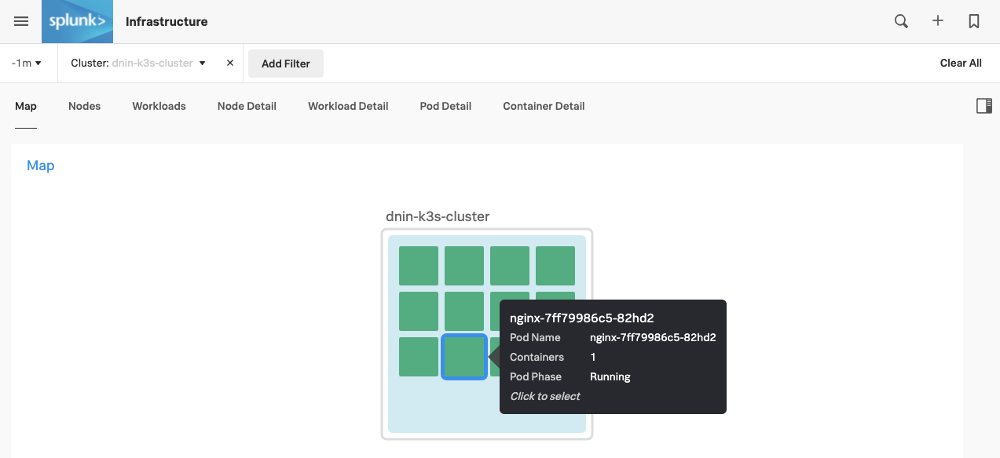
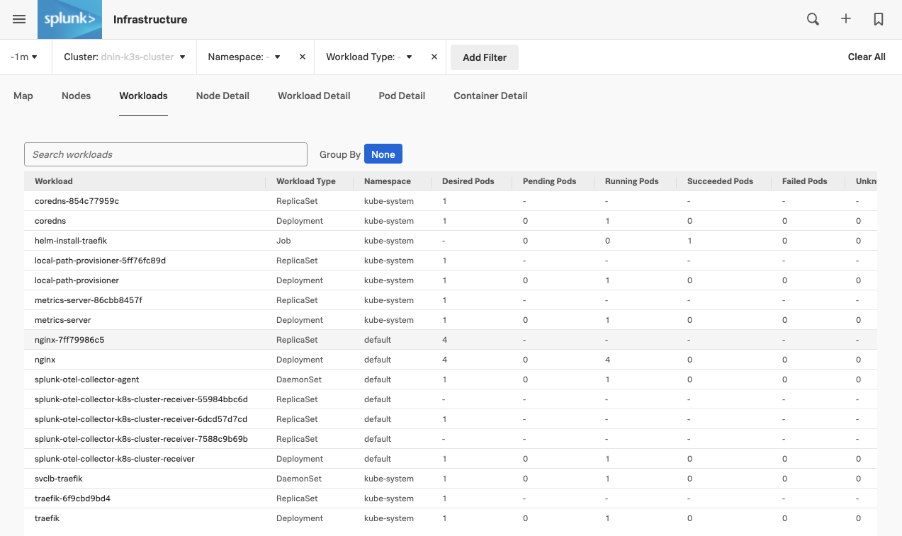

# Deploying NGINX in K3s - Lab Summary

* Deploy a NGINX ReplicaSet into your K3s cluster and confirm the auto discovery of your NGINX deployment.
* Run a benchmark test to create metrics and confirm them streaming into SignalFX!

---

## 1. Start your NGINX

!!! Info
    **If you have deployed the OpenTelemetry Collector then this module of the workshop is not applicable and can be skipped!**

This deployment of NGINX has been configured to use Kubernetes pod annotations to tell the Smart Agent how to monitor the service.

This is achieved by defining the `port` and `monitor type` to use for monitoring the NGINX service e.g. `agent.signalfx.com/monitorType.80: "collectd/nginx"`

Verify the number of pods running in the SignalFx UI by selecting the **WORKLOADS** tab. This should give you an overview of the workloads on your cluster.

{: .zoom}

Note the single agent container running per node among the default Kubernetes pods. This single container will monitor all the pods and services being deployed on this node!

Now switch back to the default cluster node view by selecting the **MAP** tab and select your cluster again.

In the Multipass or AWS/EC2 shell session and change into the `nginx` directory:

=== "Shell Command"

    ```text
    cd ~/workshop/k3s/nginx
    ```
  
---

## 2. Create NGINX deployment

Create the NGINX `configmap`[^1] using the `nginx.conf` file:

=== "Shell Command"

    ```text
    sudo kubectl create configmap nginxconfig --from-file=nginx.conf
    ```

=== "Output"

    ```
    configmap/nginxconfig created
    ```

Then create the deployment:

=== "Shell Command"

    ```
    sudo kubectl create -f nginx-deployment.yaml
    ```

=== "Output"

    ```
    deployment.apps/nginx created
    service/nginx created
    ```

Validate the deployment has been successful and that the NGINX pods are running.

If you have the SignalFx UI open you should see new Pods being started and containers being deployed.

It should only take around 20 seconds for the pods to transition into a Running state. In the SignalFx UI you will have a cluster that looks like below:

{: .zoom}

If you select the **WORKLOADS** tab again you will now see that there is a new ReplicaSet and a deployment added for NGINX:

{: .zoom}

---

Let's validate this in your shell as well:

=== "Shell Command"

    ```text
    sudo kubectl get pods
    ```

=== "Output"

    ```text
    NAME                     READY   STATUS    RESTARTS   AGE
    signalfx-agent-7mljv     1/1     Running   0          87m
    nginx-7554f6c668-pdjkp   1/1     Running   0          65s
    nginx-7554f6c668-pddfj   1/1     Running   0          65s
    nginx-7554f6c668-ggblg   1/1     Running   0          65s
    nginx-7554f6c668-mjtsh   1/1     Running   0          65s
    ```

Next create an environment variable containing the `CLUSTER_IP` of NGINX:

=== "Shell Command"

    ```text
    CLUSTER_IP=$(sudo kubectl get svc nginx -n default -o jsonpath='{.spec.clusterIP}')
    ```

Confirm the environment variable has been set correctly:

=== "Shell Command"

    ```text
    curl ${CLUSTER_IP}
    ```

=== "Output"

    ```html
    <!DOCTYPE html>
    <html>
    <head>
    <title>Welcome to nginx!</title>
    <style>
        body {
            width: 35em;
            margin: 0 auto;
            font-family: Tahoma, Verdana, Arial, sans-serif;
        }
    </style>
    </head>
    <body>
    <h1>Welcome to nginx!</h1>
    <p>If you see this page, the nginx web server is successfully installed and
    working. Further configuration is required.</p>

    <p>For online documentation and support please refer to
    <a href="http://nginx.org/">nginx.org</a>.<br/>
    Commercial support is available at
    <a href="http://nginx.com/">nginx.com</a>.</p>

    <p><em>Thank you for using nginx.</em></p>
    </body>
    </html>
    ```

---

## 3. Run Siege Benchmark

Use the Siege[^2] Load Testing command to generate some traffic to light up your SignalFx NGINX dashboards. Run this a couple of times!

=== "Shell Command"

    ```base
    siege -b -r 50 -c 20 --no-parser http://${CLUSTER_IP}/ 1>/dev/null
    ```

=== "Output"

    ```text
    ** SIEGE 4.0.5
    ** Preparing 20 concurrent users for battle.
    The server is now under siege...

    Transactions:               1000 hits
    Availability:               100.00 %
    Elapsed time:               1.17 secs
    Data transferred:           20.05 MB
    Response time:              0.02 secs
    Transaction rate:           854.70 trans/sec
    Throughput:                 17.14 MB/sec
    Concurrency:                19.77
    Successful transactions:    1000
    Failed transactions:        0
    Longest transaction:        0.16
    Shortest transaction:       0.01
    ```

Validate you are seeing metrics in the UI by going to **Dashboards → NGINX → NGINX Servers**. Using the **Overrides** filter on `kubernetes_cluster:`, find the name of your cluster as returned by `echo $(hostname)-k3s-cluster` in the terminal.

{: .zoom}

[^1]: A ConfigMap is an API object used to store non-confidential data in key-value pairs. Pods can consume ConfigMaps as environment variables, command-line arguments, or as configuration files in a volume. A ConfigMap allows you to decouple environment-specific configuration from your container images, so that your applications are easily portable.

[^2]: [What is Siege?](https://github.com/JoeDog/siege){: target=_blank}
