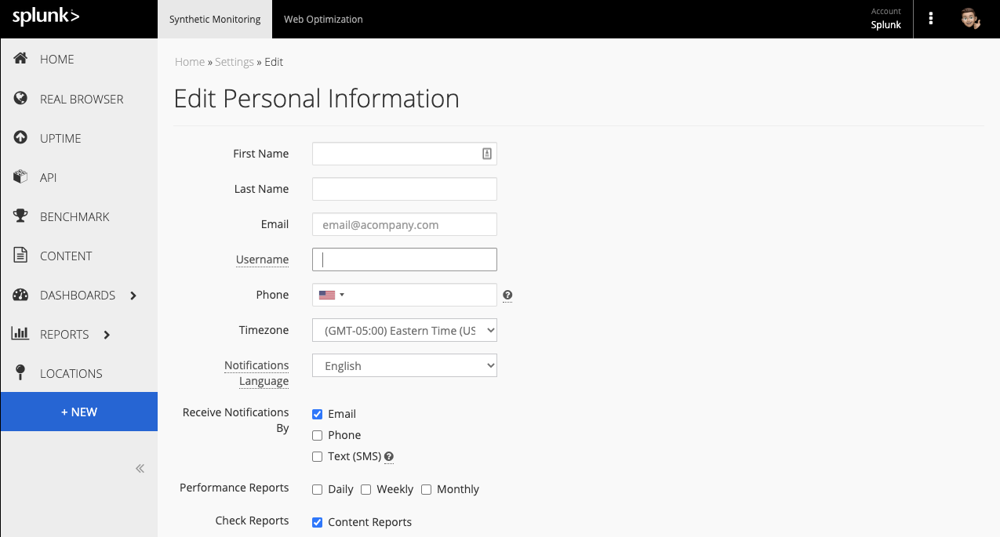
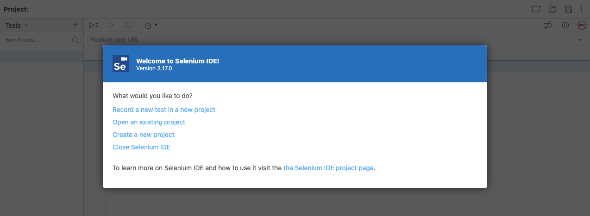
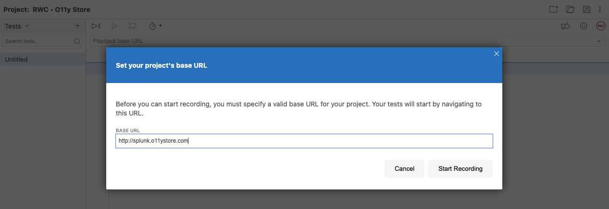
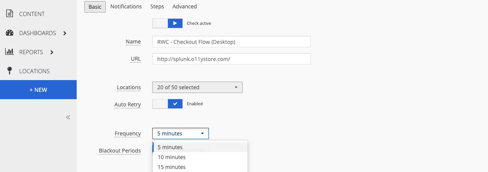
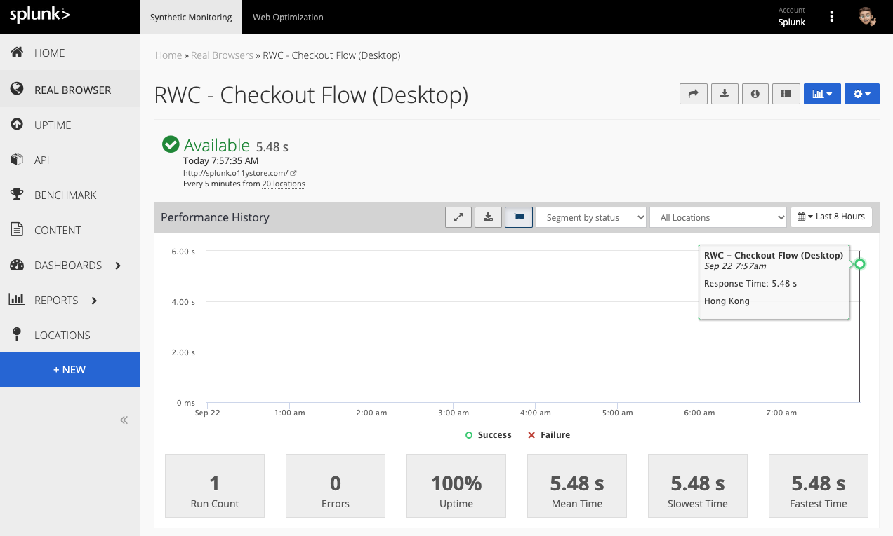
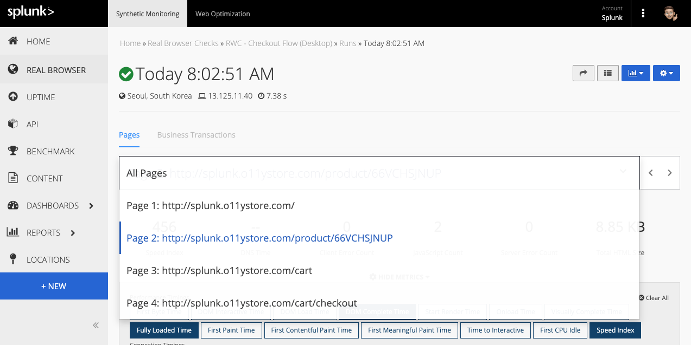
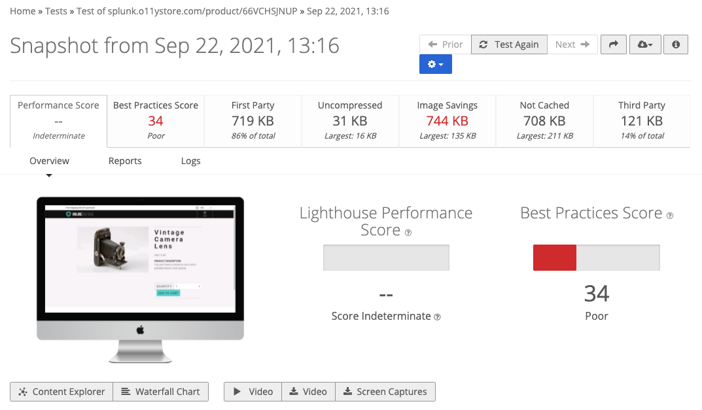
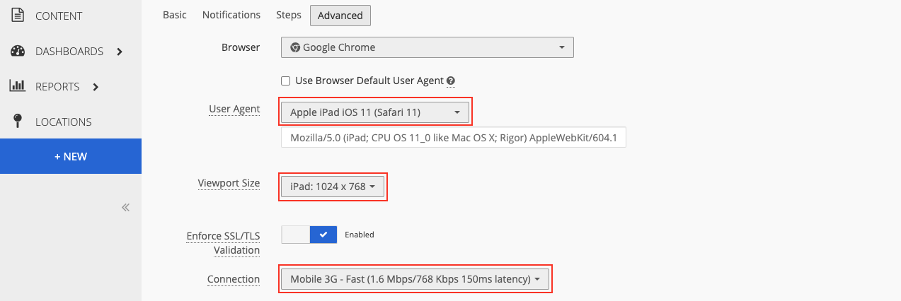

# Lab Overview

- **Splunk Synthetic Monitoring** formally [Rigor](https://rigor.com/) is a powerful monitoring service that monitors the availability of any website, mobile app, API, or system on the Internet with Uptime Checks and sends real-time alerts.

- This Lab walks your through using Chrome Selenium IDE extension to create a synthetic transaction against a Splunk demo instance and creating a Splunk Synthetic Monitoring Real Browser Check (RBC). In addition you get to learn other Splunk Synthetic Monitoring checks like REST API checks and Uptime Checks.

## Prerequisites

Login with your username and password to [https://monitoring.rigor.com](https://monitoring.rigor.com) & [https://optimization.rigor.com](https://optimization.rigor.com) and make sure you are assigned to your own account for example: **O11y Workshop**.

Edit your Splunk Synthetic Monitoring account personal information and adjust your timezone and email notifications. Splunk Synthetic Monitoring will start sending you notifications, you can turn them off at the monitoring level.



Add the [Selenium IDE](https://chrome.google.com/webstore/detail/selenium-ide/mooikfkahbdckldjjndioackbalphokd?hl=en-US) extension to your **Chrome** Browser. Click on the extension and you should see the following screen:



## Using Selenium IDE

Record a web transaction using Selenium IDE to check on broomstogo.com. Name the project "**[YOUR_INITIALS] - Brooms to Go**"

!!! question "What is Selenium IDE?"
    - Selenium IDE is an open source record and playback test automation for the web.
    - Selenium is a portable framework for testing web applications.
    - Selenium provides a playback tool for authoring functional tests without the need to learn a test scripting language (Selenium IDE).
    - It also provides a test domain-specific language (Selenese) to write tests in a number of popular programming languages, including C#, Groovy, Java, Perl, PHP, Python, Ruby and Scala.
    - The tests can then run against most modern web browsers.
    - Selenium runs on Windows, Linux, and macOS.
    - It is open-source software released under the Apache License 2.0.


Enter [https://www.broomstogo.com](https://www.broomstogo.com) as your Base URL.



Click **Start Recording**, a new window should open up with broomstogo.com - click **Catalog**, select a product, and then add it to the cart, and then click **Checkout**

Close the window and then stop the recording by navigating back to Selenium IDE and name the test: "**[YOUR_INITIALS] - Checkout Flow (Desktop)**"


Your Selenium IDE Project will look something like this:


Test your recording by pressing on the play button, make sure your recording successfully completes the transaction:


Save your Selenium IDE Project to your Downloads folder


## Create Real Browser Check

Login to Splunk Synthetic Monitoring using [https://monitoring.rigor.com](https://monitoring.rigor.com). Click on Real Browse, create a new RBC and Adjust the **New RBC** name to your **[YOUR_INIITIALS]** followed by **[YOUR_INITIALS] - Checkout Flow (Desktop)**


Click on "**From File**" and select your recording then click on Import


Set the **Frequency** to **5 Minutes**



Click on Steps and make the following adjustments to your recording provide a friendly name to Steps 1, 2, 3 & 4


Adjust Step 3 to use a JSPath Selector, in order to retrieve the selector this can be accomplished using Chrome developer tools. Follow the numbered UI clicks in the screenshot and use a right mouse click operation to "**Copy selector**", paste it into Step 3 as shown in the above screenshot.

Here is the actual selector you need to Login into Splunk

=== "Javascript"
  
    ```javascript
    document.querySelector("#AddToCart--product-template")
    ```


!!! info
    **Tip 1:** Use \'**command + f**\' in inspector to ensure that there is only one instance of the selector you are using.

    **Tip 2:** As you are creating the steps think about how to go about using the "[Business Transaction](https://help.rigor.com/hc/en-us/articles/360049442854-How-Do-I-Use-Business-Transactions)" feature in Splunk Synthetic Monitoring which is very powerful. *"Business Transactions are a combined group of contiguous steps in a Real Browser script that are to be measured as a whole. These transactions logically group similar parts of a flow together, so that users can view the performance of multiple steps and page(s) grouped under one Business Transaction."*

Click on "**Test**" to test your recording, make sure to click on "**After**" in Step 4 to validate the monitor was able to get to the checkout screen.


Add a **"Return to Cart"** Step 5 to your recording. Use the "**CSS**" Selector, here is the actual selector you need to return to the cart

=== "HTML"

   ```text
   body > div > div > div > main > div.step > form > div.step__footer > a > span
   ```


Save your Real Browser Monitor and validate your monitor is working i.e. producing successful checks



!!! info
    **Tip:** You can force to run your monitor now using **Run Now**

    

Change your view to **Segment by location** and observe the difference. You can turn off/on locations by clicking on them.

!!! question "Question?"
    Which Location has the poorest **Response Time**?


Click on one of the successful circles to drilldown into that Run:


Take a moment to explore the metrics with the "Configure Metrics" dropdown


Click "Page 2" in the dropdown, and scroll down to view the **Filmstrip** and the **Waterfall Chart.**



Click on **Click Here to Analyze with Optimization** which will prompt to login to your Splunk Synthetic Monitoring Optimization Account. If you **don't have this option**, navigate to this page: [](https://optimization.rigor.com/s/2194959?tid=ov&sh=3AF8C48AADD6D3E5F5DAA8B4B7BB7F45)


Click the "**Best Practices Score**" tab. Scroll down, and review all the findings



Spend some time to review the findings. Click into any line item

## Create Mobile RBC

Clone the RBC you created above and name it, for example: **AP - Checkout Flow (Tablet)**

Update the following three settings and create your new RBC.



Test & Validate the new monitor

!!! info
    **Tip:** As you are creating the steps try using the "[Business Transaction](https://help.rigor.com/hc/en-us/articles/360049442854-How-Do-I-Use-Business-Transactions)" feature in Splunk Synthetic Monitoring. *"Business Transactions are a combined group of contiguous steps in a Real Browser script that are to be measured as a whole. These transactions logically group similar parts of a flow together, so that users can view the performance of multiple steps and page(s) grouped under one Business Transaction."*

## Resources

- [Getting Started With Selenium IDE](https://help.rigor.com/hc/en-us/articles/115004652007?flash_digest=b1ef7d1a07b68d5279ee5fef8adb87fb878cf010)

- [Splunk Synthetic Monitoring Scripting Guide](http://www2.rigor.com/scripting-guide)

- [How Can I Fix A Broken Script?](https://help.rigor.com/hc/en-us/articles/115004443988-How-Can-I-Fix-A-Broken-Script)

- [Introduction to the DOM](https://developer.mozilla.org/en-US/docs/Web/API/Document_Object_Model/Introduction) (Document Object Model (DOM)

- [Selenium IDE](https://www.selenium.dev/selenium-ide/)